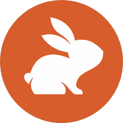
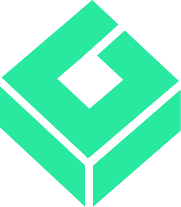

# Sponsors

Thank you to everyone funding ECC's open-source work. Your sponsorship is what lets the OSS layer stay free while the GitHub App, hosted security scans, and continuous improvements ship every week.

## Strategic Sponsors — $3,700/mo

*Become a [Strategic sponsor](https://github.com/sponsors/affaan-m) to be featured here.*

## Business Sponsors

| Sponsor | Logo | Since |
|---------|------|-------|
| [**CodeRabbit**](https://www.coderabbit.ai) |  | 2026 |
| [**Greptile**](https://www.greptile.com/go/ecc) |  | 2026 |
| [**Atlas Cloud**](https://www.atlascloud.ai/developer) |  | 2026 |

*[Become a Business sponsor](https://github.com/sponsors/affaan-m) to get README sponsor placement + SPONSORS.md listing. Current public Business tier is $800/mo. Existing $500/mo Business sponsors are grandfathered. No seats, SLA, custom development, or preferential technical placement is bundled unless separately agreed.*

## Team Sponsors — $200/mo

| Sponsor | Since |
|---------|-------|
| [Mike Morgan](https://github.com/mikejmorgan-ai) | 2026 |

*[Become a Team sponsor](https://github.com/sponsors/affaan-m) to be listed in SPONSORS.md.*

## Pro Sponsors — $50/mo

*[Become a Pro sponsor](https://github.com/sponsors/affaan-m) to support the project and be listed here.*

## Builder Sponsors — $25/mo

- @jasonwu513 (grandfathered at $10)
- @1anter (grandfathered at $10)
- @massimotodaro (grandfathered at $10)
- @meadmccabe (grandfathered at $10)

*[Become a Builder sponsor](https://github.com/sponsors/affaan-m) to support the project and get your name in this list.*

## Supporters — $10/mo

*[Become a Supporter](https://github.com/sponsors/affaan-m) to back the project with a profile badge and a thank-you in release notes.*

---

## Sponsorship Tiers

| Tier | Monthly | Perks |
|------|--------:|-------|
| Supporter | $10 | Sponsor badge on profile, thank-you in release notes |
| Builder | $25 | Above + name in SPONSORS.md |
| Pro Sponsor | $50 | Above + listed in SPONSORS.md |
| Team Sponsor | $200 | SPONSORS.md listing |
| Business Sponsor | $800 | README sponsor placement + SPONSORS.md listing |
| Strategic Sponsor | $3,700 | Premium sponsor placement + sponsor placement call |

[**Become a Sponsor →**](https://github.com/sponsors/affaan-m)

For corporate sponsorship inquiries, custom partnerships, or PR integrations, email **[affaan@ecc.tools](mailto:affaan@ecc.tools)** with your company name and intended tier.

---

## Why Sponsor?

Your sponsorship directly funds:

- **OSS work that stays free** — the core repo, AgentShield, install scripts, and skills library remain MIT
- **Weekly releases** — full-time work on the harness, not a side project
- **Independent maintenance** — no acquisition pressure, no rug pulls, no enshittification
- **Sponsor-funded roadmap** — paid sponsors fund ongoing work without turning unpaid README placement into a supply-chain risk

## Existing Sponsors Are Grandfathered

If you sponsored before May 2026, you keep your original perks at your original price. New tiers apply to new sponsors only.

---

*Updated by Hermes. Last sync: 2026-06-16*
