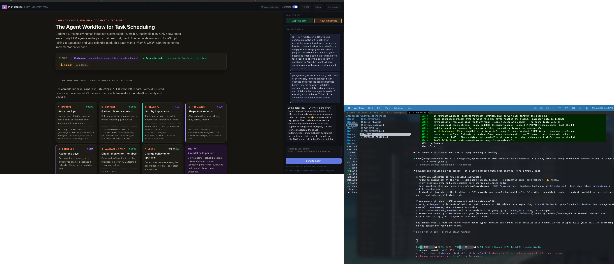

# Plan Canvas — interactive plan review in the browser

Status: implemented (`feat/plan-canvas`)
Inspired by: [lavish-axi](https://github.com/kunchenguid/lavish-axi) by @kunchenguid, the
idea of a local, annotate-and-chat review loop over agent-generated artifacts. Plan Canvas is
an original, ECC-native implementation of that idea, not a port.



## Problem

`/plan` ends with a hard gate: the agent writes `.claude/plans/{name}.plan.md` and WAITS for
the user to confirm. Today that review happens as a wall of markdown in the terminal, and the
feedback loop is "retype what you want changed in chat." The community has asked for the same
loop lavish-axi popularized: see the plan rendered properly, point at the part you mean, and
talk to the agent from the page.

## What it is

A loopback-only web editor for plan artifacts (and any local HTML artifact):

- The agent runs `node scripts/plan-canvas.js open <artifact>` after writing a plan.
- The artifact opens in the browser inside ECC-styled chrome (same design tokens as
  `scripts/dashboard-web.js`): dark-first, `--accent #6885e8`, accent→pink brand gradient,
  light theme toggle.
- The human reviews visually, clicks elements or selects text to attach numbered annotations,
  and chats with the agent from a side rail.
- Plan-specific verdict actions — **Approve plan** / **Request changes** — map directly onto
  `/plan`'s CONFIRM gate, so approval can happen from the canvas instead of the terminal.
- The agent blocks on `node scripts/plan-canvas.js await <artifact>` (long poll). Feedback
  arrives as JSON on stdout: chat messages, annotations with CSS-selector + text-range
  anchors, verdicts, or session-end.
- The agent replies with `await --reply "..."`, which appears in the canvas chat; edits to the
  artifact file live-reload the page.

## How it fits ECC

| Piece | Location | Follows |
|---|---|---|
| CLI entry | `scripts/plan-canvas.js` (+ npm bin `ecc-plan-canvas`) | `scripts/control-pane.js` |
| Server | `scripts/lib/plan-canvas/server.js` | control-pane loopback server, host-header + Origin allowlist (DNS-rebinding guard) |
| Editor chrome | `scripts/lib/plan-canvas/ui.js` | `scripts/lib/control-pane/ui.js`, tokens from `scripts/dashboard-web.js` |
| Markdown plan renderer | `scripts/lib/plan-canvas/markdown.js` | zero new deps; renders the `commands/plan.md` artifact schema (tables, tasks, code fences, Mermaid blocks) |
| Mermaid diagrams | `scripts/lib/plan-canvas/ui.js` | ` ```mermaid ` blocks render in the browser, themed to ECC; pinned CDN with offline fallback (`ECC_PLAN_CANVAS_MERMAID_URL` for a local mirror) |
| Session state | `scripts/lib/plan-canvas/sessions.js` | file-path-keyed sessions, state under `~/.claude/plan-canvas/` (`ECC_PLAN_CANVAS_STATE_DIR` override) |
| Skill | `skills/plan-canvas/SKILL.md` | skills-first surface; teaches the open → await → reply loop; defers visual guidance to `frontend-design-direction`, `artifact-design`, `dataviz` |
| Command shim | `commands/plan-canvas.md` | legacy parity surface, points at the skill |
| `/plan` pointer | `commands/plan.md` | after writing the artifact, offer canvas review |
| Hook (optional) | `scripts/hooks/plan-canvas-sessions.js`, `SessionStart` | surfaces open canvas sessions so a fresh session can resume a review |
| Tests | `tests/lib/plan-canvas/*`, `tests/integration/plan-canvas-e2e.test.js` | node:test-style plain assert, run by `tests/run-all.js` |

Registration: `package.json` (`bin`, `files[]`), `manifests/install-components.json`
(+ `install-modules.json` workflow-quality paths), `agent.yaml` skills list, catalog +
command-registry regeneration.

## Cross-harness / model compatibility

The feature is model- and harness-agnostic by construction: the CLI emits plain JSON and the
skill teaches a shell-plus-stdout loop, so any capable agent drives it identically — the same
"just a CLI" thesis lavish-axi uses. There is no Claude-only dependency in the core loop; the
`SessionStart` hook is an additive Claude Code convenience (other harnesses see open sessions
from a bare `ecc-plan-canvas` invocation).

Surfaces mirror how peer workflow-quality skills ship across ECC's harnesses:

- `skills/plan-canvas/` — canonical (Claude Code and the installer's per-target adapters).
- `.agents/skills/plan-canvas/` (+ `agents/openai.yaml` interface manifest) — Codex, alongside
  `tdd-workflow`, `e2e-testing`, `verification-loop`.
- `agent.yaml` skills list — the Codex gitagent manifest.
- The CLI resolves from any project via the `ecc-plan-canvas` bin (global/plugin install) or
  `$CLAUDE_PLUGIN_ROOT/scripts/plan-canvas.js`, never a cwd-relative path.

Cursor's checked-in subset is content/marketing skills only, so — matching peers — plan-canvas
is not added there; the installer still places it for Cursor from the canonical `skills/`.

## Protocol

Sessions are keyed by canonical artifact path (`sha256(realpath)[:12]`). The CLI talks to a
detached server (`server.json` in the state dir records pid/port/version; idle self-shutdown
after 30 min, `ECC_PLAN_CANVAS_IDLE_MS`). Feedback is deliver-and-drain: queued items are
handed to exactly one `await` call and persisted to disk until then, so nothing is lost if
the poll is interrupted.

- `GET /health` — `{ok, app: "ecc-plan-canvas", version}` (CLI/server version handshake)
- `GET /` — session list (ECC chrome)
- `POST /api/sessions` `{file, reopen?}` — open/resume; `409 user-ended` unless `reopen`
- `GET /canvas/<key>` — editor chrome; `GET /artifact/<key>/` — rendered artifact
  (markdown → ECC plan template, HTML passthrough) with the annotation SDK injected;
  sibling assets confined to the artifact directory
- `POST /api/session/<key>/feedback` `{items[], endSession?}` — browser queues
  chat / annotation / verdict items
- `GET /api/await?file=<path>[&timeoutMs=n]` — agent long-poll (whitespace heartbeat);
  returns `{status: feedback|ended|waiting|missing, items[], sessionEnded?, endedBy?}`
- `POST /api/session/<key>/reply` `{text}` — agent message → canvas chat
- `POST /api/session/<key>/end` (user) / `POST /api/end` `{file}` (agent) — ender recorded;
  user ends are sticky: plain `open` refuses to reopen without `--reopen`
- `GET /events/<key>` — SSE to the browser: `chat-sync`, `presence`
  (waiting/listening/working), `reload` (artifact file changed), `ended`

## Deliberate differences from lavish-axi

- Plan-first: renders `.plan.md` / `.md` natively (including Mermaid); lavish is HTML-only.
- Verdict actions wired to ECC's plan-confirmation workflow.
- ECC design tokens and chrome; JSON (not TOON) agent output.
- Mermaid renders themed to ECC, but without lavish's pan/zoom or node-id capture —
  whole-element annotation covers pointing at a diagram or node.
- No export/share hosting, no layout-audit gate, no bundled playbooks — ECC's existing
  design skills (`frontend-design-direction`, `artifact-design`, `dataviz`) cover authoring.

## Security posture

Loopback bind only by default; Host and Origin allowlist checks on every request (same
approach as control-pane); artifact served only from registered session paths with
sibling-asset access confined to the artifact directory; state dir is user-local. The server
never executes artifact content — it only serves it to the browser.

The one optional outbound request is the pinned Mermaid library, fetched by the browser only
for artifacts that contain a diagram; it renders with `securityLevel: 'strict'`, degrades to
showing diagram source if unavailable, and can be repointed at a local mirror via
`ECC_PLAN_CANVAS_MERMAID_URL`. The server itself still makes no network calls.
