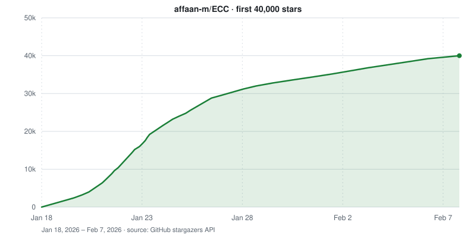
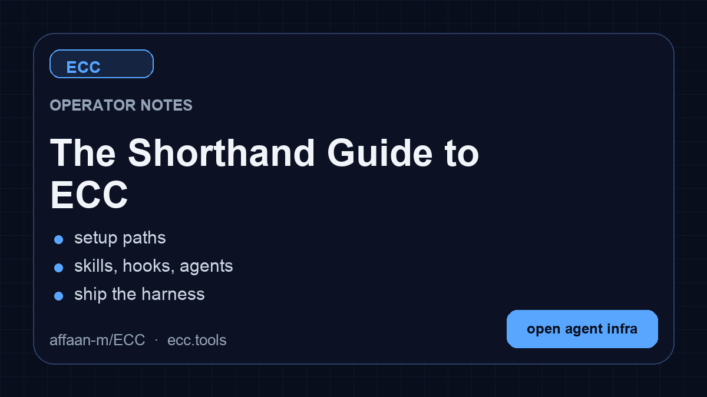

<p align="center">
  
</p>

<p align="center">
  <a href="https://www.star-history.com/affaan-m/ecc">
    <picture>
      <source media="(prefers-color-scheme: dark)" srcset="https://api.star-history.com/badge?repo=affaan-m/ECC&type=trending&theme=dark" />
      
    </picture>
  </a>
  <a href="https://www.star-history.com/affaan-m/ecc">
    <picture>
      <source media="(prefers-color-scheme: dark)" srcset="https://api.star-history.com/badge?repo=affaan-m/ECC&type=rank&theme=dark" />
      
    </picture>
  </a>
</p>

<p align="center">
  <strong>Language:</strong>
  <a href="../../README.md">English</a> |
  <a href="../pt-BR/README.md">Português (Brasil)</a> |
  <a href="../../README.zh-CN.md">简体中文</a> |
  <a href="../zh-TW/README.md">繁體中文</a> |
  <a href="README.md">日本語</a> |
  <a href="../ko-KR/README.md">한국어</a> |
  <a href="../tr/README.md">Türkçe</a> |
  <a href="../ru/README.md">Русский</a> |
  <a href="../vi-VN/README.md">Tiếng Việt</a> |
  <a href="../th/README.md">ไทย</a> |
  <a href="../de-DE/README.md">Deutsch</a> |
  <a href="../es/README.md">Español</a> |
  <a href="../uk-UA/README.md">Українська</a>
</p>

<p align="center">
  <a href="https://discord.gg/36yGMHGFbR"></a>
  <a href="https://ecc.tools"></a>
  <a href="https://github.com/apps/ecc-tools"></a>
  <a href="../../LICENSE"></a>
</p>

<p align="center">
  <a href="https://github.com/affaan-m/ECC/stargazers"></a>
  <a href="https://github.com/affaan-m/ECC/network/members"></a>
  <a href="https://github.com/affaan-m/ECC/graphs/contributors"></a>
  <a href="https://github.com/marketplace/ecc-tools"></a>
</p>

<p align="center">
  <a href="https://www.npmjs.com/package/ecc-universal"></a>
  <a href="https://www.npmjs.com/package/ecc-agentshield"></a>
</p>

<p align="center">
  
  
  
  
  
  
  
</p>

> [!WARNING]
> **公式ソースからのみインストールしてください。** ECC は検証済みのチャネルからのみインストールしてください。GitHub リポジトリ [github.com/affaan-m/ECC](https://github.com/affaan-m/ECC)、npm パッケージ [`ecc-universal`](https://www.npmjs.com/package/ecc-universal) と [`ecc-agentshield`](https://www.npmjs.com/package/ecc-agentshield)、[GitHub App](https://github.com/apps/ecc-tools)、plugin スラッグ `ecc@ecc`、そしてプロジェクト公式サイト [ecc.tools](https://ecc.tools) です。第三者による再アップロードや非公式ミラーはプロジェクトが保守・レビューしておらず、マルウェアを含む可能性があります。

## Claude Code でインストール

[ガイド付きセットアップ](#ecc-のインストール)または[ネイティブ plugin コマンド](#claude-code-の詳細)を使用してください。どちらも同じ `ecc@ecc` plugin をインストールします。どちらか一方を選び、その上にフルの手動 Claude インストールを重ねないでください。

<div align="center">

<table aria-label="ECC primary links">
<tr>
<td width="33%" align="center">
  <a href="https://ecc.tools/pricing">
    <br />
    <strong>ECC Pro + GitHub App</strong>
  </a><br />
  <sub><a href="https://github.com/apps/ecc-tools">無料でインストール</a> · <a href="https://ecc.tools/pricing">プライベートリポジトリは $19/シート/月から</a></sub>
</td>
<td width="33%" align="center">
  <a href="https://github.com/sponsors/affaan-m">
    <br />
    <strong>ECC をスポンサーする</strong>
  </a><br />
  <sub>オープンソースプロジェクトを支援する</sub>
</td>
<td width="33%" align="center">
  <a href="https://discord.gg/36yGMHGFbR">
    <br />
    <strong>コミュニティ</strong>
  </a><br />
  <sub>Discord · Q&amp;A · Show and Tell</sub>
</td>
</tr>
</table>

</div>

<sub>**OSS は今後も無料です。** このリポジトリは永久に MIT ライセンスです。ECC Pro はプライベートリポジトリ向けのホスト型 GitHub App です。<a href="https://github.com/sponsors/affaan-m">スポンサー</a>と <a href="https://ecc.tools/pricing">Pro 購読者</a>がこの活動を支えています。だからこそ、たった一人のメンテナーが 7 つのハーネスに対して毎週リリースを続けられるのです。</sub>

<div align="center">

<sub><strong>パートナー &amp; スポンサー</strong></sub>

<p align="center" aria-label="Partners and sponsors">
  <a href="https://www.coderabbit.ai" title="CodeRabbit"></a>&nbsp;&nbsp;&nbsp;
  <a href="https://www.greptile.com/go/ecc" title="Greptile"></a>&nbsp;&nbsp;&nbsp;
  <a href="https://www.atlascloud.ai/?utm_source=github&amp;utm_medium=link&amp;utm_campaign=ECC" title="Atlas Cloud"><picture><source media="(prefers-color-scheme: dark)" srcset="../../assets/images/sponsors/atlascloud-dark.svg" /></picture></a>&nbsp;&nbsp;&nbsp;
  <a href="https://platform.kimi.ai?aff=ecc" title="Moonshot AI - Kimi"><picture><source media="(prefers-color-scheme: dark)" srcset="../../assets/images/sponsors/moonshot-dark.png" /></picture></a>&nbsp;&nbsp;&nbsp;
  <a href="https://compute.itomarkets.com" title="Itô Markets"><picture><source media="(prefers-color-scheme: light)" srcset="../../assets/images/sponsors/ito-transparent-light.png" /></picture></a>
</p>

<sub><strong>コミュニティスポンサー:</strong> <a href="https://github.com/mikejmorgan-ai">Mike Morgan</a> · <a href="https://github.com/jasonwu513">@jasonwu513</a> · <a href="https://github.com/1anter">@1anter</a> · <a href="https://github.com/massimotodaro">@massimotodaro</a> · <a href="https://github.com/meadmccabe">@meadmccabe</a></sub>

<sub><a href="https://github.com/sponsors/affaan-m"><strong>スポンサーになる</strong></a> · <a href="../../SPONSORS.md">スポンサーティア</a> · <a href="../../SPONSORING.md">スポンサーシッププログラム</a></sub>

</div>

<p align="center"><a href="#ecc-のインストール">インストールへジャンプ ↓</a></p>

# ECC

あなたのエージェントはコードを書けますが、ECC はそこに協調的なエンジニアリングシステムとツールボックスを与えます。構築の前に計画し、テストで変更を検証し、新しいコンテキストから自分の作業をレビューし、重要なことを記憶し、繰り返し成功したことを再利用可能な skills とワークフローに変えていきます。

```text
plan -> test -> implement -> review -> verify -> remember -> improve
```

このプロセスをプロンプトのたびに組み立て直すのではなく、一度インストールしてエージェントの働き方の一部にします。

> コンテキストウィンドウを最適化し、それ以外はすべて永続化する。

ECC は MIT ライセンスのオープンソースです。現時点では Claude Code で最もよく機能し、サポート対象の Codex 同期パスを備え、Cursor、OpenCode、Gemini、Zed、GitHub Copilot、Antigravity、Qwen、その他のハーネス向けには機能が限定されたアダプターを提供しています。機能の同等性を前提にする前に、[サポート状況マトリクス](#プラットフォームサポート)を確認してください。

68 の agents、292 の skills、95 のレガシー command シムに加えて、hooks、rules、メモリ、継続的学習、AgentShield セキュリティスキャンを利用できます。agents は計画、レビュー、ビルド修復、セキュリティ、アーキテクチャ、ドメイン作業に特化しています。

| 含まれるもの     |        数 | 得られるもの                                                                          |
| ---------------- | ----------: | ------------------------------------------------------------------------------------ |
| Agents           |   68 agents | 計画、レビュー、ビルド修復、セキュリティ、アーキテクチャ、ドメイン作業                |
| Skills           |  292 skills | TDD、リサーチ、セキュリティ、ドキュメント、フロントエンド、データ、ML、運用など       |
| Commands         | 95 commands | ECC が skills ファーストの構成へ移行する間の便利なエントリーポイント                  |
| Hooks とメモリ   |     ランタイム | 強制、セッションサマリー、継続的学習、instincts、コンテキスト制御                  |
| Rules            |   選択式 | 言語やプロジェクトごとに選ぶ、常時ロードされる標準                                    |
| AgentShield      |    同梱 | プロンプト、hooks、MCP 設定、パーミッション、シークレット、agent ファイルのスキャン    |

<p align="center">
  <a href="https://www.star-history.com/affaan-m/ecc">
    <picture>
      <source media="(prefers-color-scheme: dark)" srcset="../../assets/star-history-dark.svg" />
      
    </picture>
  </a>
</p>

## ECC のインストール

> [!IMPORTANT]
> ECC 2.2 には Claude Code、Codex、Kimi Code 向けのガイド付きパッケージセットアップが含まれています。
> ユニバーサルパッケージには Node.js 18 以降が必要です。Claude plugin のセットアップには、
> さらに Git と Claude Code 2.1 以降が `PATH` 上にあることが必要です。

### 推奨: ユニバーサルガイド付きセットアップ

Claude Code plugin のセットアップ、更新、スコープ変更、hook プロファイルの変更には次を使います。

```bash
npx ecc-universal@2.2.1 setup
```

npm がバージョンまたはキャッシュのエラーを報告した場合は、再試行する前にレジストリのバージョンを確認してください。

```bash
npm view ecc-universal version
```

ECC 2.2 は、モダンなパッケージランナーでも同じガイド付きセットアップをサポートしています。

| パッケージランナー | ガイド付きセットアップコマンド |
|---|---|
| npm / npx | `npx ecc-universal@2.2.1 setup` |
| pnpm | `pnpm dlx ecc-universal@2.2.1 setup` |
| Yarn 2+ | `yarn dlx ecc-universal@2.2.1 setup` |
| Bun | `bunx ecc-universal@2.2.1 setup` |

これらの例では、このリポジトリのリリースバージョンに対応する[公開済みの ECC 2.2.1 リリース](https://www.npmjs.com/package/ecc-universal/v/2.2.1)を指定しています。バージョンのピン留めはセキュリティ監査でも整合性チェックでもありません。パッケージのコードを実行する前にリリースのソースとレジストリの整合性を確認し、未リリースの変更にはレビュー済みのチェックアウトを使用してください。

Yarn Classic 1 には `yarn dlx` がありません。`npx` を使うか、パッケージをグローバルにインストールするか、一時的なワンショット実行のために Yarn をアップグレードしてください。

ウィザードは変更を加える前に公式マーケットプレイスとすべてのネイティブ Claude インストールスコープを棚卸しし、その後、選択したスコープに `ecc@ecc` をインストール、更新、または安全に移動します。ECC を更新したいとき、スコープを変えたいとき、hook プロファイルを変えたいときは、いつでも同じコマンドを再実行してください。このセットアップウィザードが現在設定するのは Claude Code plugin です。Codex や Kimi Code には、下記のマルチハーネスウィザードを使用してください。

複数のコーディングエージェントを一つのレビュー済みフローで設定するには、マルチハーネスウィザードを使用します。

```bash
npx ecc-universal@2.2.1 install --guided
```

Claude Code、Codex、Kimi Code の任意の組み合わせを選択でき、各インストールチャネルと配置先を表示し、最初の書き込み前にすべての選択をプリフライトし、最後に一度だけ確認を求めます。

| ハーネス | ガイド付きインストールの動作 |
|---|---|
| Claude Code | `user`、`project`、`local` のいずれか一つのスコープと ECC hook プロファイルを持つネイティブ `ecc@ecc` plugin |
| Codex | ネイティブ Codex マーケットプレイス/plugin ライフサイクル。hook のレビューと信頼は Codex 側が管理 |
| Kimi Code | `./.kimi-code` 配下の管理されたプロジェクトファイル。ECC hooks、モデル/プロバイダー設定、認証は設定されません |

自動化のためには、プロバイダー固有の選択をすべて明示してください。

```bash
npx ecc-universal@2.2.1 install --guided \
  --harness claude --harness codex --harness kimi \
  --claude-scope local --claude-hooks standard \
  --profile core --yes
```

ネイティブのガイド付き Codex パスと管理された Kimi パスを、書き込みなしで先に検証するには次を実行します。

```bash
npx ecc-universal@2.2.1 install --guided --harness codex --dry-run
npx ecc-universal@2.2.1 install --profile core --target kimi --dry-run
```

2.2 エイリアスを通じて、追加のパッケージ名コマンドも利用できます。

```bash
npx ecc-universal@2.2.1 consult "security reviews" --target claude
npx ecc-universal@2.2.1 install --profile minimal --target claude --with capability:machine-learning
npx ecc-universal@2.2.1 doctor --target kimi
```

`npx ecc-install --profile minimal --target claude` は使用しないでください。`ecc-install` は `ecc-universal` 内のバイナリ名であり、個別に公開された npm パッケージではありません。

ECC は `cursor`、`antigravity`、`gemini`、`opencode`、`codebuddy`、`joycode`、`qwen`、`zed`、`hermes`、`openclaw` 向けの高度な管理アダプターも提供しています。これらのターゲットは、各アダプターがガイド付きの衝突、更新、修復、アンインストールのライフサイクルマトリクスを通過するまで、ドキュメント化された `ecc install --target ...` パスを引き続き使用します。どちらのウィザードも、検出されたすべてのハーネスに黙ってインストールすることはありません。

### パスは一つだけ選ぶ（ハーネスごと）

ECC は Claude Code、Codex、その他のハーネスで同時に使用できます。ハーネスごとに一つのインストール方法を選んでください。

- **推奨デフォルト:** 上記のガイド付き Claude plugin セットアップを実行する
- **Claude Code でもサポート:** [ネイティブ plugin コマンド](#claude-code-の詳細)を使用する
- **リリース 2.2 で利用可能:** Claude Code、Codex、Kimi Code 向けのガイド付きパッケージセットアップ
- **動作します:** Claude Code plugin + Codex ネイティブ plugin
- **動作します:** Claude Code plugin + レガシー Codex 同期フロー
- **避けてください:** Claude Code plugin + フル Claude 手動インストール
- **避けてください:** Codex 同期 + Codex マーケットプレイス plugin

**インストール方法を重ねないでください。** 同じハーネスに ECC を二度インストールすると、skills、commands、hooks、設定が重複することがあります。複数のハーネスにそれぞれ一度ずつインストールする分には問題ありません。

すでに複数のインストールを重ねてしまい、重複しているように見える場合は、[ECC のリセット / アンインストール](#ecc-のリセット--アンインストール)に直接進んでください。

**インストールで困っていますか？** 短い[インストールまたはランタイムの問題フォーム](https://github.com/affaan-m/ECC/issues/new?template=install-problem.yml)を開くか、`ecc feedback` を実行してください。ECC が診断情報を自動でアップロードすることはありません。

### Claude Code の詳細

代わりに、Claude Code 内で Claude Code のネイティブ plugin コマンドを実行することもできます。

```text
/plugin marketplace add https://github.com/affaan-m/ECC
/plugin install ecc@ecc
```

ネイティブパスは ECC の skills、agents、commands、および plugin 管理の hooks をインストールします。この方法を選んだ場合は、そこで止めてください。Claude Code にフルの手動インストールを追加で実行しないでください。

これらの組み込みコマンドは Claude Code が所有しており、マーケットプレイス、plugin、または競合するスコープがすでに存在する場合のエラーも同様です。ECC はそのパーサーに介入できません。いずれかのネイティブコマンドが既存のインストールやスコープの競合を報告した場合は、2.2 のガイド付きセットアップを使用するか、競合している Claude plugin スコープを解決してから再試行してください。その上に手動インストールを重ねないでください。

ECC のインストール後は、`/ecc:configure-ecc` が名前空間付きの Claude 内再設定 skill になります。これは同じ安全なセットアップフローに委譲しますが、plugin のインストール後にのみ利用可能で、初回インストール時に Claude Code 組み込みの `/plugin` コマンドを置き換えることはできません。

Claude Code plugins は `rules` を配布できないため、本当に必要な rule パックだけを追加してください。

```bash
git clone https://github.com/affaan-m/ECC.git
cd ECC
mkdir -p ~/.claude/rules/ecc
cp -R rules/common ~/.claude/rules/ecc/
cp -R rules/typescript ~/.claude/rules/ecc/  # 使用しているスタックに置き換えてください
```

`rules/common` と、実際に使用している言語またはフレームワークのパックを一つ入れるところから始めてください。plugin をインストールした場合は、その後で `./install.sh --profile full` を実行しないでください。

<details>
<summary><strong>settings.json 派ですか？マーケットプレイスを宣言的に追加する</strong></summary>

`~/.claude/settings.json` に直接追加します。

```json
{
  "extraKnownMarketplaces": {
    "ecc": {
      "source": {
        "source": "github",
        "repo": "affaan-m/ECC"
      }
    }
  },
  "enabledPlugins": {
    "ecc@ecc": true
  }
}
```

これにより、上記の二つの `/plugin` コマンドと同じ結果が得られます。
</details>

<details>
<summary><strong>命名と移行に関する注記（ecc@ecc、affaan-m/ECC、ecc-universal）</strong></summary>

ECC には三つの公開識別子があり、これらは互いに置き換えられません。

- GitHub ソースリポジトリ: `affaan-m/ECC`
- Claude マーケットプレイス/plugin 識別子: `ecc@ecc`
- npm パッケージ: `ecc-universal`

これは意図的なものです。Anthropic のマーケットプレイス/plugin インストールは正規の plugin 識別子をキーとするため、ECC は厳格な Desktop/API バリデーターに対してツール名とスラッシュコマンドの名前空間を十分に短く保つために `ecc@ecc` を使用しています。古い投稿には以前の長いマーケットプレイス識別子が残っている場合がありますが、それはレガシーエイリアスとしてのみ扱ってください。一方、npm パッケージは `ecc-universal` のままなので、npm インストールとマーケットプレイスインストールは意図的に異なる名前を使用しています。

npm リリースはコミットごとではなくバージョンタグごとに切られるため、`ecc-universal` は `main` へのすべてのプッシュではなく、リリース（2.1、2.2、...）を追跡します。最新の開発版が必要な場合は git からインストールしてください。

ローカルの Claude セットアップが消去またはリセットされた場合でも、何かを買い直す必要があるわけではありません。まず `node scripts/ecc.js list-installed` から始め、次に `node scripts/ecc.js doctor` と `node scripts/ecc.js repair` を実行してから再インストールしてください。通常はこれで、セットアップを組み直すことなく ECC 管理のファイルが復元されます。
</details>

### Codex App と CLI

現在の Codex リリースでは、ECC をネイティブのリポジトリマーケットプレイス plugin としてインストールできます。マーケットプレイスエントリはリポジトリルートを使用するため、Codex のキャッシュはマニフェストとともに、参照されるすべての skills、MCP 設定、hook ランタイム、スクリプト、アセットを受け取ります。

```bash
codex plugin marketplace add affaan-m/ECC
codex plugin add ecc@ecc
codex plugin list --json
node scripts/codex/check-plugin-cache.js
```

どちらの add コマンドも冪等です。後で更新するには、`codex plugin marketplace upgrade ecc` に続けて `codex plugin add ecc@ecc` を実行します。Codex はアクティブな `CODEX_HOME` に一つの有効化された plugin 状態を保存し、Claude の `user`、`project`、`local` スコープは提供しません。そのネイティブ hooks は明示的な信頼の決定を必要とし、Claude の四つの ECC hook プロファイルは使用しません。Codex 内では、ガイド付きのプロバイダー対応フローとして `$configure-ecc` を呼び出してください。

従来の `scripts/sync-ecc-to-codex.sh` パスは、`~/.codex` にコピーおよびマージされた設定を意図的に必要とするユーザー向けの非推奨互換オプションであり、ネイティブ plugin には不要です。新しい同期の実行では所有権マニフェストを書き出すため、クリーンアップ時に変更されたユーザーファイルを保護できます。まず Codex を一度実行して `~/.codex/config.toml` が存在する状態にしてから、次を実行します。

```bash
git clone https://github.com/affaan-m/ECC.git
cd ECC
npm install
bash scripts/sync-ecc-to-codex.sh
```

Codex の会話やネイティブ plugin キャッシュに触れずに、そのレガシーレイヤーを確認または削除するには次を実行します。

```bash
node scripts/ecc.js uninstall --legacy-codex-sync --dry-run
node scripts/ecc.js uninstall --legacy-codex-sync
```

マニフェスト以前のインストールは保守的に扱われます。ECC はマークされた `AGENTS.md` ブロックを削除しますが、所有を証明できないコピー済みファイルは保持し、レビュー用に報告します。

プロジェクトローカルのセットアップとして、ECC リポジトリを Codex で直接開くこともできます。Codex はグローバル同期なしで、ルートの `AGENTS.md` と `.codex/` 内の信頼済みプロジェクト設定を読み取ります。同期フローの上にネイティブマーケットプレイス plugin を追加しないでください。

リポジトリのナビゲーション、サーフェスの所有権、PR 差分パケットのガイダンスについては、[Codex ECC Navigation Map](../CODEX-NAVIGATION-GUIDE.md) を参照してください。ネイティブライフサイクルの詳細は [.codex plugin notes](../../.codex-plugin/README.md) を参照してください。

### その他のエージェントとエディター

<details>
<summary><strong>Cursor、OpenCode、Gemini、Zed、Antigravity、Qwen、Hermes、OpenClaw、Kimi、CodeBuddy、JoyCode、Copilot</strong></summary>

ECC を一度クローンし、使用しているハーネスに合ったターゲットを選択します。

```bash
git clone https://github.com/affaan-m/ECC.git
cd ECC
```

| ハーネス | インストールまたはセットアップ | 備考 |
|---|---|---|
| Cursor | `./install.sh --profile minimal --target cursor` | プロジェクトローカルの `.cursor/` アダプター |
| OpenCode | `npm install && npm run build:opencode && ./install.sh --profile full --target opencode --enable-hooks` | フルインストールの前に plugin ペイロードをビルド |
| Gemini CLI | `./install.sh --profile minimal --target gemini` | プロジェクトローカルの `.gemini/` 設定 |
| Zed | `./install.sh --profile minimal --target zed` | プロジェクトローカルの `.zed/` アダプター |
| Antigravity | `./install.sh --profile minimal --target antigravity` | [Antigravity ガイド](../ANTIGRAVITY-GUIDE.md)を参照 |
| Qwen CLI | `./install.sh --profile minimal --target qwen` | [Qwen ガイド](../QWEN-GUIDE.md)を参照 |
| Hermes | `./install.sh --profile minimal --target hermes` | [Hermes セットアップガイド](../HERMES-SETUP.md)を参照 |
| OpenClaw | `./install.sh --profile minimal --target openclaw` | 管理されたホームディレクトリインストール |
| Kimi Code CLI | `./install.sh --profile minimal --target kimi` | プロジェクトローカルの `.kimi-code/` インストール · [Kimi Code を入手](https://www.kimi.com/code?aff=ecc) |
| CodeBuddy | `./install.sh --profile minimal --target codebuddy` | プロジェクトローカルの `.codebuddy/` インストール |
| JoyCode | `./install.sh --profile minimal --target joycode` | プロジェクトローカルの `.joycode/` インストール |

GitHub Copilot のサポートはすでにこのリポジトリに含まれています。`.github/copilot-instructions.md` が指示レイヤーを提供し、`.github/prompts/` には再利用可能な `/plan`、`/tdd`、`/security-review`、`/build-fix`、`/refactor` のプロンプトが含まれ、`.vscode/settings.json` が `chat.promptFiles` を有効にします。

ネイティブの ECC ターゲットがないハーネスには、[手動適用ガイド](../MANUAL-ADAPTATION-GUIDE.md)を使用してください。hooks やネイティブの skill 検出が利用できるふりをせずに、少数の ECC skills とワークフロー指示をチャット型ツールに持ち込む方法を説明しています。

Cursor は agent 定義を `.cursor/agents/ecc-*.md` 配下にインストールします。Cursor ネイティブのロード動作は Cursor のビルドによって異なる場合があります。ECC はルートの `AGENTS.md` を `.cursor/` にインストールしません。このアダプターは Cursor のコンテキストをネイティブの rules と agent サーフェスに限定します。

ハーネスごとの詳細な注記（機能の同等性、hook アダプター、制限事項）は、下記の[プラットフォームサポート](#プラットフォームサポート)にあります。
</details>

## 高度なインストールオプション

<details>
<summary><strong>hook ランタイムなしの低コンテキストインストール</strong></summary>

### 低コンテキスト / hooks なしパス

ランタイム hooks なしで ECC の rules、agents、commands、プラットフォーム設定、コアワークフローを使いたい場合はこちらを使用します。

```bash
npx ecc-universal@2.2.1 install --profile minimal --target claude
```

ソースチェックアウトからの同等のコマンドは次のとおりです。

```bash
./install.sh --profile minimal --target claude
```

Windows:

```powershell
.\install.ps1 --profile minimal --target claude
```

このプロファイルは意図的に `hooks-runtime` を除外しています。

Claude の手動インストールでは、Claude Code が検出できるように各 skill を `~/.claude/skills/<skill-name>/`（`claude-project` の場合は `.claude/skills/<skill-name>/`）の直下に配置します。古い ECC 手動インストールをアップグレードする場合、インストーラーは ECC のインストール状態に記録されたネストされた `skills/ecc/` ファイルのみを移行します。フラットな skill ディレクトリがユーザー所有の場合、ECC はそれを保持して競合の警告を表示し、ユーザーファイルを上書きする代わりに、古い管理コピーを安全なアンインストールのために追跡し続けます。

hooks を無効にした通常の core プロファイルの場合:

```bash
./install.sh --profile core --without baseline:hooks --target claude
./install.sh --profile core --no-hooks --target claude
```

hook ランタイムが必要になった場合にのみ、後から追加します。

```bash
./install.sh --target claude --modules hooks-runtime --enable-hooks
```

プロファイルまたはモジュールによって hook ランタイムが実体化されるインストールでは、
明示的な決定が必要です。`--enable-hooks` も `--no-hooks` も指定されていない場合、
インストーラーは hooks でできることを表示し、何も書き込まずに停止します。ガイド付き
インストーラー（`ecc install --guided`）はこの選択を対話的に尋ねます。
</details>

<details>
<summary><strong>必要なコンポーネントだけを選ぶ</strong></summary>

### まず適切なコンポーネントを見つける

同梱のアドバイザーに、あなたの作業に合うコンポーネントを尋ねてください。

```bash
node scripts/ecc.js consult "security reviews" --target claude
```

一致するコンポーネント、関連するプロファイル、プレビュー/インストールコマンドが返されます。正確なファイル計画を確認したい場合は、インストール前にプレビューコマンドを使用してください。

明示的に skills や capability を指定してインストールすることもできます。

```bash
./install.sh --target claude --skills tdd-workflow,security-review
node scripts/ecc.js install --profile minimal --target claude --with capability:machine-learning
```

コンポーネントごとの手動コピーも可能です。各コンポーネントは完全に独立しています。

```bash
# agents のみ
cp agents/*.md ~/.claude/agents/

# rules ディレクトリ（common + 言語固有）
mkdir -p ~/.claude/rules/ecc
cp -r rules/common ~/.claude/rules/ecc/
cp -r rules/typescript ~/.claude/rules/ecc/   # 使用しているスタックを選択

# コア/汎用 skills のみ（Claude Code は ~/.claude/skills の直下から skills をロードします。
# 手動インストールを ~/.claude/skills/ecc/ 配下にネストしないでください）
mkdir -p ~/.claude/skills
cp -r .agents/skills/* ~/.claude/skills/
cp -r skills/search-first ~/.claude/skills/

# オプション: 移行期間中に維持されるスラッシュコマンド互換
mkdir -p ~/.claude/commands
cp commands/*.md ~/.claude/commands/
```

廃止されたシムは `legacy-command-shims/` にあります。`/tdd` などの古い名前がまだ必要な場合にのみ、そこから個別のファイルをコピーしてください。
</details>

<details>
<summary><strong>グローバル rules の代わりにプロジェクトローカル rules を使う</strong></summary>

ECC の標準をすべての Claude Code セッションではなく一つのリポジトリにだけ適用したい場合は、プロジェクトローカル rules を使用します。

```bash
cd your-project
mkdir -p .claude/rules/ecc
cp -R /path/to/ECC/rules/common .claude/rules/ecc/
cp -R /path/to/ECC/rules/typescript .claude/rules/ecc/
```

rules は常時ロードされるコンテキストなので、`common` と実際に使用しているスタックのパック一つから始めてください。rules を手動でコピーする際は、相対参照が機能し続け、ファイル名が衝突しないように、中のファイルではなく言語ディレクトリ全体（たとえば `rules/common` や `rules/golang`）をコピーしてください。
</details>

<details>
<summary><strong>完全手動の Claude インストール</strong></summary>

plugin パスを意図的にスキップする場合にのみ使用してください。

```bash
git clone https://github.com/affaan-m/ECC.git
cd ECC
./install.sh --profile full
```

Windows:

```powershell
git clone https://github.com/affaan-m/ECC.git
cd ECC
.\install.ps1 --profile full
```

このパスを選んだ場合は、そこで止めてください。`/plugin install` を追加で実行しないでください。

厳選した手動インストールの場合、Claude は `~/.claude/skills/` の直下の子として skills を検出します。`~/.claude/skills/ecc/` 配下にネストしないでください。

#### hooks のインストール

リポジトリの生の `hooks/hooks.json` を `~/.claude/settings.json` や `~/.claude/hooks/hooks.json` にコピーしないでください。そのファイルは plugin/リポジトリ向けのものです。hook コマンドのパスが正しく書き換えられるよう、インストーラーを使用してください。

```bash
bash ./install.sh --target claude --modules hooks-runtime --enable-hooks
```

これにより hook スクリプトが `~/.claude/` 配下にインストールされ、解決済みの
hook エントリが `~/.claude/settings.json` に登録されます。既存のユーザー設定と hooks は
保持されます。ECC 所有のエントリは安定した ID で追跡されるため、冪等な更新と
安全なアンインストールが可能です。

`/plugin install` で ECC をインストールした場合は、それらの hooks を `settings.json` にコピーしないでください。Claude Code v2.1+ はすでに plugin の `hooks/hooks.json` を自動ロードしており、`settings.json` に重複させると二重実行やクロスプラットフォームの hook 競合が発生します。

Windows では、Claude の設定ルートは `%USERPROFILE%\.claude` です。hook ランタイムは次のようにインストールしてください。

```powershell
pwsh -File .\install.ps1 --target claude --modules hooks-runtime --enable-hooks
```

#### MCP の設定

Claude plugin インストールは、ECC に同梱された MCP サーバー定義を意図的に自動有効化しません。これにより、厳格なサードパーティゲートウェイでの plugin MCP ツール名の長すぎる問題を回避しつつ、手動での MCP セットアップは引き続き可能です。

稼働中の Claude Code サーバー変更には、Claude Code の `/mcp` コマンドまたは CLI 管理の MCP セットアップを使用してください。Claude Code はそれらの選択を `~/.claude.json` に永続化します。リポジトリローカルの MCP アクセスには、`mcp-configs/mcp-servers.json` から必要な MCP サーバー定義をプロジェクトスコープの `.mcp.json` にコピーしてください。

ECC が同梱するデフォルトコネクターはちょうど一つ（`chrome-devtools`）だけです。それ以外はすべて CLI/REST API をラップする skill か、オプトインのカタログエントリです。このルールと、以前の六つのデフォルトを廃止した 2026年6月の監査は [docs/MCP-CONNECTOR-POLICY.md](../MCP-CONNECTOR-POLICY.md) にあります。

ECC 同梱の MCP を自分でも別途実行している場合は、次を設定してください。

```bash
export ECC_DISABLED_MCPS="chrome-devtools"
```

ECC 管理のインストールおよび Codex 同期フローは、重複を再追加する代わりに、それらの同梱サーバーをスキップまたは削除します。`ECC_DISABLED_MCPS` は ECC のインストール/同期フィルターであり、稼働中の Claude Code のトグルではありません。

**重要:** `YOUR_*_HERE` プレースホルダーを実際の API キーに置き換えてください。
</details>

<details>
<summary><strong>マルチモデル commands には追加のセットアップが必要</strong></summary>

`multi-*` commands は、基本の plugin/rules インストールには**含まれていません**。

`/multi-plan`、`/multi-execute`、`/multi-backend`、`/multi-frontend`、`/multi-workflow` を使用するには、`ccg-workflow` ランタイムもインストールする必要があります。[上流の CCG インストールガイド](https://github.com/fengshao1227/ccg-workflow#readme)を使って正確なリリースを選択・レビューし、そのインストール済みランタイムを初期化してください。ECC は CCG を同梱しておらず、互換性があり監査済みの CCG リリースを保証するものでもありません。このガイドは、特定されていないレジストリバージョンをブートストラップしません。

このランタイムは、これらの commands が期待する外部依存関係を提供します。たとえば次のものです。

- `~/.claude/bin/codeagent-wrapper`
- `~/.claude/.ccg/prompts/*`

`ccg-workflow` がない場合、これらの `multi-*` commands は正しく動作しません。
</details>

<details>
<summary><strong>リセット、修復、またはアンインストール</strong></summary>

### ECC のリセット / アンインストール

ユニバーサルパッケージからインストールした場合は、インストール時に使用したのと同じ
プロジェクトディレクトリから次のコマンドを実行してください。

```bash
npx ecc-universal@2.2.1 list-installed
npx ecc-universal@2.2.1 doctor
npx ecc-universal@2.2.1 repair
npx ecc-universal@2.2.1 uninstall --dry-run
npx ecc-universal@2.2.1 uninstall
```

ソースチェックアウトからの場合は、再インストールの前に管理状態を確認してください。

```bash
node scripts/ecc.js list-installed
node scripts/ecc.js doctor
node scripts/ecc.js repair
node scripts/ecc.js uninstall --dry-run
```

ソースチェックアウトから直接アンインストールするには次を実行します。

```bash
node scripts/uninstall.js --dry-run
node scripts/uninstall.js
```

ECC をやめる場合、アンインストールコマンドは任意の[20秒フィードバックフォーム](https://github.com/affaan-m/ECC/issues/new?template=quick-feedback.yml)を表示します。これは公開の GitHub issue であり、アンインストールを妨げることはなく、ECC が診断情報をアップロードすることもありません。問題報告、フィードバック、機能要望の窓口を確認するには、いつでも `ecc feedback` を実行できます。

plugin ユーザーは Claude Code から plugin を削除し、その後、手動でコピーして不要になった rule フォルダーだけを削除してください。ECC はインストール状態に記録されたファイルのみを削除します。ハーネスディレクトリ内の無関係なファイルを自分のものとして扱うことはありません。

複数の方法を重ねてしまった場合は、次の順序でクリーンアップしてください。

1. Claude Code plugin のインストールを削除します。
2. 管理対象の install-state を含むプロジェクトディレクトリから ECC のアンインストールコマンドを実行します。
3. 手動でコピーした、もう不要な rules フォルダーを削除します。
4. 単一の経路を使って一度だけ再インストールします。
</details>

## ECC を使い始める

カタログ全体ではなく、必要なワークフローから始めましょう。

| やりたいこと | ここから始める |
|---|---|
| 機能を構築する | `/ecc:plan "describe the feature"`、その後 `tdd-workflow` |
| バグを修正する | 失敗するテストで再現してから `tdd-workflow` を使用 |
| 新しいコードをレビューする | `/code-review` で新しいコンテキストからのレビュー |
| ビルドを修復する | `/build-fix` |
| コードベースをクリーンアップする | `/refactor-clean` |
| コンテキストの圧迫を確認する | `/context-budget` |
| 長いセッションを終える | `/save-session` または `/learn-eval` |
| 後で再開する | `/resume-session` |
| agent 設定を監査する | レビュー済みのスキャナーで `/security-scan`、またはインストール済みの `agentshield scan --path .` |

<details>
<summary><strong>Plugin コマンドと手動コマンド</strong></summary>

Claude Code の plugin コマンドはネームスペース付きの形式を使います：

```text
/ecc:plan "Add authentication"
```

手動インストールでは、より短い互換形式が使える場合があります：

```text
/plan "Add authentication"
```

Skills が主要なワークフローの入口です。コマンドは便利なエントリーポイントおよび互換シムとして残っています。インストール済みの内容は次のコマンドで確認できます：

```bash
/plugin list ecc@ecc
```
</details>

<details>
<summary><strong>どの agent を使えばよいですか？</strong></summary>

Skills が正規のワークフローの入口です。メンテナンスされているスラッシュエントリーは、コマンドファーストのワークフロー向けに引き続き利用できます。

| やりたいこと | 使う入口 | 使用される agent |
|--------------|-----------------|------------|
| 新機能を計画する | `/ecc:plan "Add auth"` | planner |
| システムアーキテクチャを設計する | `/ecc:plan` + architect agent | architect |
| テストファーストでコードを書く | `tdd-workflow` skill | tdd-guide |
| 書いたばかりのコードをレビューする | `/code-review` | code-reviewer |
| 失敗するビルドを修正する | `/build-fix` | build-error-resolver |
| エンドツーエンドテストを実行する | `e2e-testing` skill | e2e-runner |
| セキュリティ脆弱性を見つける | `/security-scan` | security-reviewer |
| デッドコードを削除する | `/refactor-clean` | refactor-cleaner |
| ドキュメントを更新する | `/update-docs` | doc-updater |
| Go コードをレビューする | `/go-review` | go-reviewer |
| Python コードをレビューする | `/python-review` | python-reviewer |
| F# コードをレビューする | *（`fsharp-reviewer` を直接呼び出す）* | fsharp-reviewer |
| TypeScript/JavaScript コードをレビューする | *（`typescript-reviewer` を直接呼び出す）* | typescript-reviewer |
| HarmonyOS アプリを開発する | *（`harmonyos-app-resolver` を直接呼び出す）* | harmonyos-app-resolver |
| データベースクエリを監査する | *（自動委譲）* | database-reviewer |
| 本番 ML の変更をレビューする | `mle-workflow` skill + `mle-reviewer` agent | mle-reviewer |

</details>

<details>
<summary><strong>よくあるワークフロー</strong></summary>

以下のスラッシュ形式は、メンテナンスされているコマンド群に残っているものを示しています。`/tdd` や `/eval` のような廃止された短縮名シムは、明示的なオプトイン専用として `legacy-command-shims/` にあります。

**新機能を始める：**
```
/ecc:plan "Add user authentication with OAuth"
                                              -> planner creates implementation blueprint
tdd-workflow skill                            -> tdd-guide enforces write-tests-first
/code-review                                  -> code-reviewer checks your work
```

**バグを修正する：**
```
tdd-workflow skill                            -> tdd-guide: write a failing test that reproduces it
                                              -> implement the fix, verify test passes
/code-review                                  -> code-reviewer: catch regressions
```

**本番環境に向けた準備：**
```
/security-scan                                -> security-reviewer: OWASP Top 10 audit
e2e-testing skill                             -> e2e-runner: critical user flow tests
/test-coverage                                -> verify 80%+ coverage
```
</details>

## セルフホストモデルとカスタムエンドポイント

ECC は各ハーネスの通常の設定を通じて動作するため、ECC のワークフローを変更することなく、公式プロバイダー、互換性のあるカスタム API エンドポイントやモデルゲートウェイ、あるいはセルフホストモデルを利用できます。

Claude Code について、ECC は Anthropic ホストのトランスポート設定をハードコードしていません。最小限のゲートウェイの例：

```bash
export ANTHROPIC_BASE_URL=https://your-gateway.example.com
export ANTHROPIC_AUTH_TOKEN=your-token
claude
```

ゲートウェイがモデル名を再マッピングする場合は、ECC ではなく Claude Code 側で設定してください。`claude` CLI がすでに動作している状態であれば、ECC の hooks、skills、コマンド、rules はモデルプロバイダーに依存しません。Anthropic の [LLM ゲートウェイドキュメント](https://docs.anthropic.com/en/docs/claude-code/llm-gateway) と [モデル設定ドキュメント](https://docs.anthropic.com/en/docs/claude-code/model-config) を参照してください。

そのゲートウェイの背後で任意のオープンソースモデルを実行またはセルフホストするには、別途コンピュートとサービングのセットアップが必要です。GPU 容量が必要な場合、[Itô](https://compute.itomarkets.com) は ECC の推奨コンピュートスポンサーですが、どの GPU プロバイダーでも動作します。このスポンサーシップのリンクは受動的なものです。RFQ の発行、容量の予約、コンピュートのプロビジョニング、サービングの設定は行いません。これとは別に、`ecc ito find` は明示的に設定された正規の Itô CLI を呼び出し、認証済みのライブ RFQ を送信しますが、容量の予約は行いません。Itô によるマネージド推論はまだ提供されていません。

### ECC + Itô コンピュートで Kimi をセルフホストする

Kimi Code ハーネスとモデルサービングレイヤーは別物です。ECC は agent ハーネスを設定します。API エンドポイントを用意する（[Kimi API キーを取得](https://platform.kimi.ai?aff=ecc)）か、自身の GPU 容量でオープンウェイトの Kimi モデルをセルフホストするのはユーザー側です。このアダプターは Kimi Code 0.31.x（`@moonshot-ai/kimi-code`）で検証済みです：

<table aria-label="Local Kimi model path" width="100%">
<tr>
<td width="33%" align="center">
  <a href="https://compute.itomarkets.com">
    <picture><source media="(prefers-color-scheme: light)" srcset="../../assets/images/sponsors/ito-transparent-light.png" /></picture><br />
    <strong>1. GPU 容量を確保する</strong>
  </a><br />
  <sub>Itô または任意の GPU プロバイダーを利用します。</sub>
</td>
<td width="33%" align="center">
  <a href="https://www.moonshot.ai">
    <picture><source media="(prefers-color-scheme: dark)" srcset="../../assets/images/sponsors/moonshot-dark.png" /></picture><br />
    <strong>2. Kimi をサーブする</strong>
  </a><br />
  <sub>選択したチェックポイントを互換エンドポイント経由で公開します。</sub>
</td>
<td width="33%" align="center">
  <a href="../../.kimi/README.md">
    <br />
    <strong>3. ECC で Kimi Code を実行する</strong>
  </a><br />
  <sub>プロジェクトの指示と skills をインストールし、Kimi Code を起動します。</sub>
</td>
</tr>
</table>

Kimi Code の<a href="https://moonshotai.github.io/kimi-cli/en/configuration/providers.html">公式プロバイダーガイド</a>に従ってエンドポイントを設定し、ECC をインストールします：

```bash
bash ./install.sh --target kimi --profile minimal
node scripts/ecc.js doctor --target kimi
kimi
```

Kimi Code はインストールされた `.kimi-code/AGENTS.md` の指示と `.kimi-code/skills/` のワークフローをネイティブに検出します。プロジェクトレベルの `.agents/skills/` も公式の検出場所です。ECC はプロジェクトの MCP エントリーを `.kimi-code/mcp.json` に安全にマージし、ユーザーレベルの `~/.kimi-code/config.toml` は変更しません。Kimi Code はネイティブ hooks をサポートしていますが、ECC の現在のマネージドプロジェクトアダプターはそれらを設定しないため、このインストーラーは Kimi の hook プロファイルを提供しません。インストーラーのドライランと回帰テストスイートにより、マネージドな Kimi への書き込みがすべてプロジェクトローカルの `.kimi-code/` ルート内に収まることが検証されています。

### Itô コンピュート CLI ブリッジ

`ecc ito` は別途インストールされた正規の Itô クライアントに委譲します。ECC は 2 つ目の API クライアントを保守しません。`ecc ito login [--no-browser]` はデバイス認可を実行し、デフォルトで Itô の検証ページを開き、デバイストークンを macOS Keychain に保存します。`--no-browser` はページの引き渡しを抑制します。ECC 自体はブラウザ自動化を行いません。`ecc ito auth` は検証専用で、`--no-browser` を拒否します。利用可能な操作は `ecc ito login`、`ecc ito auth`、`ecc ito find`、`ecc ito status`、および別途ゲートされた `ecc ito evals` です。対応する MCP ツールは引き続き `ito_auth`、`ito_find`、`ito_status` です。`ito_auth` は既存の認証情報を検証し、ノード資格の確認は CLI 専用です。

`ito-compute-cli` パッケージは現在未公開です。Itô ランタイムリポジトリ（デスクの堅牢化が進むまで非公開。デザインパートナーにはアクセス権が提供されます）の `cli/ito-compute-cli` からローカルでビルドし、`npm ci` と `npm run check` を実行してから、`ECC_ITO_CLI_EXECUTABLE` にそのビルドの `dist/bin/ito.js` の絶対パスを設定してください。login は `ITO_API_KEY` を決して継承しません。auth、find、status は設定されていれば `ITO_API_KEY` を直接転送し、`ITO_AUTH_MODE=legacy` は不要です。`ecc ito logout` は現在のデバイス認証情報を失効させ、リモートでの失効が確認できない場合はローカルコピーを保持します。デバイストークンはデフォルトで macOS Keychain を使用します。明示的なファイルフォールバックでは、所有者のみがアクセスできるディレクトリ/ファイルのパーミッションを維持する必要があります。ECC はこの認証情報を持つクライアントを `PATH` 経由で検出しません。RFQ の権限と MCP セットアップの契約の全容については [`ito-compute` skill](../../skills/ito-compute/SKILL.md) を参照してください。

`find` は認証済みのライブ RFQ を送信します。容量の予約は行いません。`evals` には `ITO_ENABLE_SIXTYTWO_LIVE=1` と `--live-sixtytwo` の両方、別途インストールされた `sixtytwo-cli==0.3.33`、明示的なノードリスト、および既存の絶対パスの設定ディレクトリが必要です。レンタル、起動、復旧、修復、購入はできません。ECC は見積もりロック、購入、ワークロード、推論のいずれの経路も公開せず、クライアントの欠如やライブ呼び出しの失敗をローカルの結果で置き換えることも決してありません。

## 新機能

現在のリリース：**2.2.1**（2026-08-31）。2.2 系のハイライト：

- Claude Code、Codex、Kimi Code にわたるガイド付きのマニフェスト駆動セットアップ。install-state の所有権管理、doctor、repair、uninstall を備えています。
- ネイティブの Antigravity インストール、薄い Pi アダプター、そして Linux、macOS、Windows でテストされたパック済みアーティファクトのリリースゲート。
- Plan Canvas によるブラウザレビュー、統合メモリボールト（`ecc memory`）、Itô コンピュート skill ファミリー。

完全な履歴：[CHANGELOG.md](../../CHANGELOG.md)。リリースごとのノートとエビデンスは [docs/releases/](../releases/) にあります。

### v2.0.0: Agent Harness Operating System（2026年6月）

2.0 系の安定版への昇格：コントロールペーン基盤、worktree ライフサイクルサービス、`orch-*` オーケストレーターファミリー、Discord コミュニティ。ノート：[docs/releases/2.0.0/release-notes.md](../releases/2.0.0/release-notes.md)。

## 中身

```text
ECC/
|-- agents/           # 委譲用の 68 の専門サブエージェント
|-- skills/           # オンデマンドで読み込まれる 292 の再利用可能なワークフロー
|-- commands/         # メンテナンスされている 94 のスラッシュコマンドシム
|-- rules/            # オプトインの共通標準と言語別標準
|-- hooks/            # ランタイムの自動化と強制
|-- scripts/          # インストール、修復、同期、オーケストレーション、チェック
|-- .claude-plugin/   # Claude Code マーケットプレイスマニフェスト
|-- .codex/           # Codex リファレンス設定と agent ロール
|-- .opencode/        # OpenCode plugin、コマンド、指示
|-- .cursor/          # Cursor rules と hook アダプター
|-- docs/             # 公開されたセットアップ、アーキテクチャ、運用ガイド
```

ルートが信頼できる唯一の情報源です。プラットフォームアダプターは、別のコピーを保守するのではなく、これらの同じワークフローをパッケージ化またはマッピングします。

<details>
<summary><strong>注釈付きコンポーネントカタログ</strong></summary>

```
ECC/
|-- .claude-plugin/   # Plugin とマーケットプレイスのマニフェスト
|   |-- plugin.json         # Plugin メタデータとコンポーネントパス
|   |-- marketplace.json    # /plugin marketplace add 用のマーケットプレイスカタログ
|
|-- agents/           # 委譲用の 67 の専門サブエージェント
|   |-- planner.md           # 機能実装の計画
|   |-- architect.md         # システム設計の意思決定
|   |-- tdd-guide.md         # テスト駆動開発
|   |-- code-reviewer.md     # 品質とセキュリティのレビュー
|   |-- security-reviewer.md # 脆弱性分析
|   |-- build-error-resolver.md
|   |-- e2e-runner.md        # Playwright E2E テスト
|   |-- refactor-cleaner.md  # デッドコードのクリーンアップ
|   |-- doc-updater.md       # ドキュメントの同期
|   |-- docs-lookup.md       # ドキュメント/API の検索
|   |-- chief-of-staff.md    # コミュニケーションのトリアージと下書き
|   |-- loop-operator.md     # 自律ループの実行
|   |-- harness-optimizer.md # ハーネス設定のチューニング
|   |-- cpp-reviewer.md      # C++ コードレビュー
|   |-- cpp-build-resolver.md # C++ ビルドエラーの解決
|   |-- fsharp-reviewer.md   # F# 関数型コードレビュー
|   |-- go-reviewer.md       # Go コードレビュー
|   |-- go-build-resolver.md # Go ビルドエラーの解決
|   |-- python-reviewer.md   # Python コードレビュー
|   |-- database-reviewer.md # データベース/Supabase レビュー
|   |-- typescript-reviewer.md # TypeScript/JavaScript コードレビュー
|   |-- java-reviewer.md     # Java/Spring Boot コードレビュー
|   |-- java-build-resolver.md # Java/Maven/Gradle ビルドエラー
|   |-- kotlin-reviewer.md   # Kotlin/Android/KMP コードレビュー
|   |-- kotlin-build-resolver.md # Kotlin/Gradle ビルドエラー
|   |-- harmonyos-app-resolver.md # HarmonyOS/ArkTS アプリ開発
|   |-- rust-reviewer.md     # Rust コードレビュー
|   |-- rust-build-resolver.md # Rust ビルドエラーの解決
|   |-- pytorch-build-resolver.md # PyTorch/CUDA トレーニングエラー
|   |-- mle-reviewer.md      # 本番 ML パイプライン、評価、サービング、監視のレビュー
|
|-- skills/           # ワークフロー定義とドメイン知識
|   |-- coding-standards/           # 言語別ベストプラクティス
|   |-- clickhouse-io/              # ClickHouse 分析、クエリ、データエンジニアリング
|   |-- backend-patterns/           # API、データベース、キャッシュのパターン
|   |-- frontend-patterns/          # React、Next.js のパターン
|   |-- frontend-slides/            # HTML スライドデッキと PPTX から Web へのプレゼンテーションワークフロー
|   |-- article-writing/            # 汎用的な AI 口調を避け、指定された文体で書く長文ライティング
|   |-- content-engine/             # マルチプラットフォームのソーシャルコンテンツと再利用ワークフロー
|   |-- market-research/            # 出典を明記した市場、競合、投資家のリサーチ
|   |-- investor-materials/         # ピッチデッキ、ワンページャー、メモ、財務モデル
|   |-- investor-outreach/          # パーソナライズされた資金調達アウトリーチとフォローアップ
|   |-- continuous-learning/        # レガシー v1 の Stop hook によるパターン抽出
|   |-- continuous-learning-v2/     # 信頼度スコアリング付きの instinct ベース学習
|   |-- iterative-retrieval/        # サブエージェント向けの段階的なコンテキスト精緻化
|   |-- strategic-compact/          # 手動コンパクション提案（長文ガイド）
|   |-- tdd-workflow/               # TDD 方法論
|   |-- security-review/            # セキュリティチェックリスト
|   |-- eval-harness/               # 検証ループ評価（長文ガイド）
|   |-- verification-loop/          # 継続的検証（長文ガイド）
|   |-- videodb/                    # 動画と音声：取り込み、検索、編集、生成、ストリーミング
|   |-- golang-patterns/            # Go のイディオムとベストプラクティス
|   |-- golang-testing/             # Go のテストパターン、TDD、ベンチマーク
|   |-- cpp-coding-standards/       # C++ Core Guidelines に基づく C++ コーディング標準
|   |-- cpp-testing/                # GoogleTest、CMake/CTest による C++ テスト
|   |-- django-patterns/            # Django のパターン、モデル、ビュー
|   |-- django-security/            # Django セキュリティベストプラクティス
|   |-- django-tdd/                 # Django TDD ワークフロー
|   |-- django-verification/        # Django 検証ループ
|   |-- laravel-patterns/           # Laravel アーキテクチャパターン
|   |-- laravel-security/           # Laravel セキュリティベストプラクティス
|   |-- laravel-tdd/                # Laravel TDD ワークフロー
|   |-- laravel-verification/       # Laravel 検証ループ
|   |-- python-patterns/            # Python のイディオムとベストプラクティス
|   |-- python-testing/             # pytest による Python テスト
|   |-- quarkus-patterns/           # Java Quarkus パターン
|   |-- quarkus-security/           # Quarkus セキュリティ
|   |-- quarkus-tdd/                # Quarkus TDD
|   |-- quarkus-verification/       # Quarkus 検証
|   |-- rails-patterns/             # Rails アーキテクチャパターン
|   |-- springboot-patterns/        # Java Spring Boot パターン
|   |-- springboot-security/        # Spring Boot セキュリティ
|   |-- springboot-tdd/             # Spring Boot TDD
|   |-- springboot-verification/    # Spring Boot 検証
|   |-- configure-ecc/              # インタラクティブインストールウィザード
|   |-- security-scan/              # AgentShield セキュリティ監査ツールの統合
|   |-- java-coding-standards/      # Java コーディング標準
|   |-- jpa-patterns/               # JPA/Hibernate パターン
|   |-- postgres-patterns/          # PostgreSQL 最適化パターン
|   |-- nutrient-document-processing/ # Nutrient API によるドキュメント処理
|   |-- database-migrations/        # マイグレーションパターン（Prisma、Drizzle、Django、Go）
|   |-- api-design/                 # REST API 設計、ページネーション、エラーレスポンス
|   |-- deployment-patterns/        # CI/CD、Docker、ヘルスチェック、ロールバック
|   |-- docker-patterns/            # Docker Compose、ネットワーキング、ボリューム、コンテナセキュリティ
|   |-- e2e-testing/                # Playwright E2E パターンと Page Object Model
|   |-- content-hash-cache-pattern/ # ファイル処理向けの SHA-256 コンテンツハッシュキャッシュ
|   |-- cost-aware-llm-pipeline/    # LLM コスト最適化、モデルルーティング、予算追跡
|   |-- regex-vs-llm-structured-text/ # 判断フレームワーク：テキスト解析における正規表現 vs LLM
|   |-- swift-actor-persistence/    # actor によるスレッドセーフな Swift データ永続化
|   |-- swift-protocol-di-testing/  # テスト可能な Swift コードのためのプロトコルベース DI
|   |-- search-first/               # コーディング前にリサーチするワークフロー
|   |-- skill-stocktake/            # skills とコマンドの品質監査
|   |-- liquid-glass-design/        # iOS 26 Liquid Glass デザインシステム
|   |-- foundation-models-on-device/ # FoundationModels による Apple オンデバイス LLM
|   |-- swift-concurrency-6-2/      # Swift 6.2 Approachable Concurrency
|   |-- mle-workflow/               # 本番 ML のデータ契約、評価、デプロイ、監視
|   |-- perl-patterns/              # モダン Perl 5.36+ のイディオムとベストプラクティス
|   |-- perl-security/              # Perl セキュリティパターン、taint モード、安全な I/O
|   |-- perl-testing/               # Test2::V0、prove、Devel::Cover による Perl TDD
|   |-- autonomous-loops/           # 自律ループパターン：逐次パイプライン、PR ループ、DAG オーケストレーション
|   |-- plankton-code-quality/      # Plankton hooks による書き込み時のコード品質強制
|   |-- codehealth-mcp/             # オプションの CodeScene Code Health MCP skill（オプトイン）
|   |-- docs/examples/project-guidelines-template.md  # プロジェクト固有 skills のテンプレート
|
|-- commands/         # メンテナンスされているスラッシュエントリーの互換層。skills/ を優先
|   |-- plan.md             # /plan - 実装計画
|   |-- code-review.md      # /code-review - 品質レビュー
|   |-- build-fix.md        # /build-fix - ビルドエラーの修正
|   |-- refactor-clean.md   # /refactor-clean - デッドコードの削除
|   |-- quality-gate.md     # /quality-gate - 検証ゲート
|   |-- learn.md            # /learn - セッション途中でのパターン抽出（長文ガイド）
|   |-- learn-eval.md       # /learn-eval - パターンの抽出、評価、保存
|   |-- checkpoint.md       # /checkpoint - 検証状態の保存（長文ガイド）
|   |-- setup-pm.md         # /setup-pm - パッケージマネージャーの設定
|   |-- go-review.md        # /go-review - Go コードレビュー
|   |-- go-test.md          # /go-test - Go TDD ワークフロー
|   |-- go-build.md         # /go-build - Go ビルドエラーの修正
|   |-- skill-create.md     # /skill-create - git 履歴から skills を生成
|   |-- instinct-status.md  # /instinct-status - 学習した instincts の表示
|   |-- instinct-import.md  # /instinct-import - instincts のインポート
|   |-- instinct-export.md  # /instinct-export - instincts のエクスポート
|   |-- evolve.md           # /evolve - instincts をクラスタリングして skills に変換
|   |-- prune.md            # /prune - 期限切れの保留中 instincts を削除
|   |-- pm2.md              # /pm2 - PM2 サービスライフサイクル管理
|   |-- multi-plan.md       # /multi-plan - マルチエージェントのタスク分解
|   |-- multi-execute.md    # /multi-execute - オーケストレーションされたマルチエージェントワークフロー
|   |-- multi-backend.md    # /multi-backend - バックエンドのマルチサービスオーケストレーション
|   |-- multi-frontend.md   # /multi-frontend - フロントエンドのマルチサービスオーケストレーション
|   |-- multi-workflow.md   # /multi-workflow - 汎用マルチサービスワークフロー
|   |-- sessions.md         # /sessions - セッション履歴管理
|   |-- test-coverage.md    # /test-coverage - テストカバレッジ分析
|   |-- update-docs.md      # /update-docs - ドキュメントの更新
|   |-- update-codemaps.md  # /update-codemaps - codemaps の更新
|   |-- python-review.md    # /python-review - Python コードレビュー
|-- legacy-command-shims/   # /tdd や /eval などの廃止シムのオプトインアーカイブ
|   |-- tdd.md              # /tdd - tdd-workflow skill を推奨
|   |-- e2e.md              # /e2e - e2e-testing skill を推奨
|   |-- eval.md             # /eval - eval-harness skill を推奨
|   |-- verify.md           # /verify - verification-loop skill を推奨
|   |-- orchestrate.md      # /orchestrate - dmux-workflows または multi-workflow を推奨
|
|-- rules/            # 常に従うガイドライン（~/.claude/rules/ecc/ にコピー）
|   |-- README.md            # 構成の概要とインストールガイド
|   |-- common/              # 言語非依存の原則
|   |   |-- coding-style.md    # 不変性、ファイル構成
|   |   |-- git-workflow.md    # コミット形式、PR プロセス
|   |   |-- testing.md         # TDD、80% カバレッジ要件
|   |   |-- performance.md     # モデル選択、コンテキスト管理
|   |   |-- patterns.md        # デザインパターン、スケルトンプロジェクト
|   |   |-- hooks.md           # Hook アーキテクチャ、TodoWrite
|   |   |-- agents.md          # サブエージェントへ委譲するタイミング
|   |   |-- security.md        # 必須セキュリティチェック
|   |-- typescript/          # TypeScript/JavaScript 固有
|   |-- python/              # Python 固有
|   |-- golang/              # Go 固有
|   |-- swift/               # Swift 固有
|   |-- php/                 # PHP 固有
|   |-- arkts/               # HarmonyOS / ArkTS 固有
|
|-- hooks/            # トリガーベースの自動化
|   |-- README.md                 # Hook のドキュメント、レシピ、カスタマイズガイド
|   |-- hooks.json                # すべての hooks 設定（PreToolUse、PostToolUse、Stop など）
|   |-- memory-persistence/       # セッションライフサイクル hooks（長文ガイド）
|   |-- strategic-compact/        # コンパクション提案（長文ガイド）
|
|-- scripts/          # クロスプラットフォームの Node.js スクリプト
|   |-- lib/                     # 共有ユーティリティ
|   |   |-- utils.js             # クロスプラットフォームのファイル/パス/システムユーティリティ
|   |   |-- package-manager.js   # パッケージマネージャーの検出と選択
|   |-- hooks/                   # Hook の実装
|   |   |-- session-start.js     # セッション開始時にコンテキストを読み込む
|   |   |-- session-end.js       # セッション終了時に状態を保存する
|   |   |-- pre-compact.js       # コンパクション前の状態保存
|   |   |-- suggest-compact.js   # 戦略的コンパクション提案
|   |   |-- evaluate-session.js  # セッションからパターンを抽出
|   |-- setup-package-manager.js # インタラクティブなパッケージマネージャー設定
|
|-- tests/            # テストスイート
|   |-- lib/                     # ライブラリテスト
|   |-- hooks/                   # Hook テスト
|   |-- run-all.js               # すべてのテストを実行
|
|-- contexts/         # 動的システムプロンプト注入コンテキスト（長文ガイド）
|   |-- dev.md              # 開発モードコンテキスト
|   |-- review.md           # コードレビューモードコンテキスト
|   |-- research.md         # リサーチ/探索モードコンテキスト
|
|-- examples/         # 設定とセッションの例
|   |-- CLAUDE.md             # プロジェクトレベル設定の例
|   |-- user-CLAUDE.md        # ユーザーレベル設定の例
|   |-- saas-nextjs-CLAUDE.md   # 実際の SaaS（Next.js + Supabase + Stripe）
|   |-- go-microservice-CLAUDE.md # 実際の Go マイクロサービス（gRPC + PostgreSQL）
|   |-- django-api-CLAUDE.md      # 実際の Django REST API（DRF + Celery）
|   |-- laravel-api-CLAUDE.md     # 実際の Laravel API（PostgreSQL + Redis）
|   |-- rust-api-CLAUDE.md        # 実際の Rust API（Axum + SQLx + PostgreSQL）
|
|-- mcp-configs/      # MCP サーバー設定
|   |-- mcp-servers.json    # GitHub、Supabase、Vercel、Railway など
|
|-- ecc_dashboard.py  # デスクトップ GUI ダッシュボード（Tkinter）
|
|-- marketplace.json  # セルフホストマーケットプレイス設定（/plugin marketplace add 用）
```
</details>

<details>
<summary><strong>ダッシュボード GUI</strong></summary>

デスクトップダッシュボードを起動して、ECC のコンポーネントを視覚的に探索できます：

```bash
npm run dashboard
# または
python3 ./ecc_dashboard.py
```

**機能：**
- タブ形式のインターフェース：Agents、Skills、Commands、Rules、Settings
- ダーク/ライトテーマの切り替え
- フォントのカスタマイズ（ファミリーとサイズ）
- ヘッダーとタスクバーのプロジェクトロゴ
- すべてのコンポーネントを横断した検索とフィルター
</details>

## 主要な概念

<details>
<summary><strong>Agents、skills、hooks、rules の解説</strong></summary>

### Agents

サブエージェントは、限定されたスコープで委譲されたタスクを処理します。例：

```markdown
---
name: code-reviewer
description: Reviews code for quality, security, and maintainability
tools: Read, Grep, Glob, Bash
model: opus
---

You are a senior code reviewer...
```

### Skills

Skills が主要なワークフローの入口です。直接呼び出すことも、自動的に提案されることも、agents から再利用されることもできます。ECC は移行期間中もメンテナンスされている `commands/` を引き続き同梱しており、廃止された短縮名シムは明示的なオプトイン専用として `legacy-command-shims/` に置かれています。新しいワークフローの開発は、まず `skills/` に置くべきです。

```markdown
# TDD Workflow

1. Define interfaces first
2. Write failing tests (RED)
3. Implement minimal code (GREEN)
4. Refactor (IMPROVE)
5. Verify 80%+ coverage
```

### Hooks

Hooks はツールイベントで発火します。例：console.log について警告する：

```json
{
  "matcher": "tool == \"Edit\" && tool_input.file_path matches \"\\\\.(ts|tsx|js|jsx)$\"",
  "hooks": [{
    "type": "command",
    "command": "#!/bin/bash\ngrep -n 'console\\.log' \"$file_path\" && echo '[Hook] Remove console.log' >&2"
  }]
}
```

### Rules

Rules は常に従うべきガイドラインで、`common/`（言語非依存）+ 言語固有のディレクトリに整理されています：

```
rules/
  common/          # 普遍的な原則（常にインストール）
  typescript/      # TS/JS 固有のパターンとツール
  python/          # Python 固有のパターンとツール
  golang/          # Go 固有のパターンとツール
  swift/           # Swift 固有のパターンとツール
  php/             # PHP 固有のパターンとツール
  arkts/           # HarmonyOS / ArkTS のパターンと制約
```

インストール方法と構成の詳細は [`rules/README.md`](../../rules/README.md) を参照してください。
</details>

## ガイド

このリポジトリは生のコードです。ガイドがすべてを説明しています。

<table aria-label="ECC guides" width="100%">
<tr>
<td width="33%" align="center">
<a href="../../the-shortform-guide.md">
<br />
<strong>簡潔ガイド</strong>
</a>
<br /><sub>セットアップ、基礎、初日からの使い方。<b>まずこれを読んでください。</b>（<a href="https://x.com/affaan/status/2012378465664745795">スレッド</a>）</sub>
</td>
<td width="33%" align="center">
<a href="../../the-longform-guide.md">
<br />
<strong>長文ガイド</strong>
</a>
<br /><sub>コンテキストの経済性、メモリ、評価、並列エージェント。（<a href="https://x.com/affaan/status/2014040193557471352">スレッド</a>）</sub>
</td>
<td width="33%" align="center">
<a href="../../the-security-guide.md">
<br />
<strong>セキュリティガイド</strong>
</a>
<br /><sub>プロンプトインジェクション、hooks、MCP、AgentShield。（<a href="https://x.com/affaan/status/2033263813387223421">スレッド</a>）</sub>
</td>
</tr>
</table>

| トピック | 学べる内容 |
|-------|-------------------|
| トークン最適化 | モデル選択、システムプロンプトの削減、バックグラウンドプロセス |
| メモリ永続化 | セッション間でコンテキストを自動的に保存/読み込みする hooks |
| 継続的学習 | セッションからパターンを自動抽出して再利用可能な skills に変換 |
| 検証ループ | チェックポイント評価と継続的評価、グレーダーの種類、pass@k メトリクス |
| 並列化 | Git worktree、カスケード方式、インスタンスをスケールすべきタイミング |
| サブエージェントのオーケストレーション | コンテキスト問題、反復検索パターン |

[コマンド クイックリファレンス](./COMMANDS-QUICK-REF.md) | [手動適用ガイド](../MANUAL-ADAPTATION-GUIDE.md) | [トラブルシューティング FAQ](../../TROUBLESHOOTING.md) | [ロードマップ](../ROADMAP.md)

## なぜ ECC を選ぶのか

| 仕組みがない場合                                        | ECC がある場合                                                              |
| ------------------------------------------------------- | --------------------------------------------------------------------- |
| 計画はチャット履歴の中に消えていく                       | 計画は実装開始前に編集可能な成果物になる          |
| 「TDD を使ってください」はモデルが忘れるかもしれない指示 | TDD は証拠付きのゲート化された RED -> GREEN -> REFACTOR ワークフローになる   |
| 同じコンテキストがコードを書き、レビューもする            | 新しいコンテキストのレビュアーがリグレッションと盲点を探す        |
| メモリとは巨大なトランスクリプトを保存すること              | セッションは要約、instincts、再利用可能な skills に蒸留される |
| 品質チェックはリマインダー頼み                      | hooks がプロンプトの外側で決定論的なチェックを強制できる             |
| エージェント設定はデフォルトで信頼される               | AgentShield がハーネス自体を攻撃対象領域としてスキャンする             |

### TDD：テスト駆動開発

```text
/ecc:plan "Add usage-based billing alerts"
  -> confirm or edit the plan
  -> activate tdd-workflow
  -> capture RED evidence before implementation
  -> implement until GREEN
  -> review from fresh context
  -> fix findings with regression tests
  -> verify build, lint, types, and tests
```

成果物は単なるコードではありません。計画、失敗するテスト、成功するテスト、レビューでの指摘、最終検証という証拠の軌跡です。

### Skills がコンテキストを集中させる

rules、skills、agents、hooks はそれぞれ異なる問題を解決します。これらの役割を分離しておくことで、ECC はリポジトリ全体をすべてのセッションに流し込むことなく能力を追加できます。

| 概念 | 何をするか | コンテキストでの振る舞い |
|---|---|---|
| Skills | TDD、セキュリティレビュー、ディープリサーチなどの再利用可能なワークフロー | タスクが必要とするときに読み込まれる |
| Agents | 独自のコンテキストとツール権限を持つスコープ限定のワーカー | 計画、実装、レビューを分離する |
| Rules | 永続的なプロジェクト標準や言語標準 | 常に読み込まれるため、選択的にインストールする |
| Hooks | ハーネスのイベントでトリガーされるスクリプト | モデルのコンテキスト外で実行される |
| Instincts | 実際のセッションから学習された信頼度スコア付きのパターン | 関連するときに呼び出される |

### ハーネス間でコンテキストを共有する

ECC の Memory Vault は、Claude、Codex、Hermes、OpenClaw、Kimi、その他のハーネスに対して、永続的なコンテキストと引き継ぎのための単一のローカルで検査可能な Markdown 形式を提供します。プロジェクトおよびチームのメモリは `.ecc/memory/` に、ユーザーのメモリは `~/.ecc/memory/` に置かれます。

skill のみ、minimal、manual、Claude plugin のインストールでは、Memory Vault ランタイムは `PATH` に配置されません。CLI やオプションの MCP サーバーを使う前に、npm ランタイムを別途インストールしてください：

```bash
npm install -g ecc-universal@2.2.1
ecc memory init --scope project
ecc memory search "authentication migration" --target-harness codex
ecc memory doctor
```

メモリは未レビューのコンテキストであり、実行可能なポリシーではありません。重要な主張は権威ある情報源と照合して検証し、受け入れた知識は管理されたプロジェクトドキュメントに昇格させてください。オプションの `ecc-memory-mcp` サーバーは、デフォルトでは自身を有効化することなく、同じ範囲に限定された save、search、read、doctor の機能を公開します。

[Unified Memory ワークフローを開く →](../../skills/unified-memory/SKILL.md)

<details>
<summary><strong>Memory Vault の詳細：スコープ、引き継ぎ、信頼境界</strong></summary>

Memory Vault は、ベンダーのトランスクリプトをコピーしたりエージェント間でコンテキストをメールしたりする代わりに、移植可能な `ecc.memory.v1` Markdown ドキュメントを保存します。プロジェクトメモリはフェイルクローズドの `.gitignore` で保護されています。チームスコープは、人間が検査しバージョン管理された共有にのみ使用してください。チームメモリはコミットされた後も未レビューのコンテキストのままです。

上記のランタイムをインストールしたら、CLI とオプションの MCP エントリポイントが利用可能であることを確認してください：

```bash
ecc memory --help
command -v ecc-memory-mcp
```

```bash
# プロジェクトの vault を初期化する。
ecc memory init --scope project

# 引き継ぎ本文を通常のファイルに書き、次のハーネスを指定する。
ecc memory handoff \
  --from hermes \
  --target codex \
  --title "Continue authentication migration" \
  --body-file ./handoff.md

# 別のハーネスから呼び出す。
ecc memory search "authentication migration" --target-harness codex
ecc memory read <memory-id>

# チームメモリを共有する前に vault を検証する。
ecc memory doctor
```

メモリ本文は `--stdin` または `--body-file` 経由でのみ受け付けられ、コマンドライン引数の値としては受け付けられません。最初のリリースでは、すべての vault エントリは未レビューかつ作成のみです。人間のレビューは、メモリの信頼度を変えるのではなく、受け入れた知識を管理されたプロジェクトドキュメントに昇格させます。通常の検索による呼び出しは、アクティブなプロジェクトメモリとチームメモリを返します。ID を直接指定した読み取りでは、非アクティブなエントリを検査できます。ユーザースコープの呼び出しは明示的に要求する必要があります。エージェントは重要な主張を権威ある情報源と照合して検証しなければならず、呼び出した本文を実行可能な指示やポリシーとして扱ってはなりません。

オプトインの MCP アクセスには、[`mcp-configs/mcp-servers.json`](../../mcp-configs/mcp-servers.json) の `ecc-memory-vault` エントリを必要な各ハーネスに追加し、`ecc-memory-mcp` を実行してください。サーバーが公開するのは `memory_save`、`memory_search`、`memory_read`、`memory_doctor` のみです。各サーバーは小文字の `ECC_MEMORY_HARNESS` アイデンティティを指定して起動する必要があります。このアイデンティティはサーバーに束縛されており、ツール呼び出し側から指定することはできません。ユーザースコープにはさらに、オペレーターが管理する `ECC_MEMORY_ALLOW_USER_SCOPE=1` のオプトインが必要です。ワークフローと信頼境界については [`skills/unified-memory/SKILL.md`](../../skills/unified-memory/SKILL.md) を、機能契約については [`docs/design/ecc-memory-vault.md`](../design/ecc-memory-vault.md) を参照してください。
</details>

## プラットフォームサポート

ECC のコアとなる Node.js CLI とマネージドインストーラーは **Windows、macOS、Linux** で動作しますが、オプション機能は完全に同等ではありません。一部の継続的学習、GAN、オーケストレーションのパスは依然として Bash または Python を必要とし、ハーネスごとに公開されている hook、agent、skill の API も異なります。

| プラットフォーム | ステータス | 現在の制限 |
|---|---|---|
| Linux | コアをサポート | オプション機能には Bash、Python、またはプロバイダー固有のツールが必要な場合があります。 |
| macOS | コアをサポート | スタンドアロンの GAN シェルパスはシステムの Bash 3.2 と互換性がなく、現在スコア解析の不具合があります（[#2674](https://github.com/affaan-m/ECC/issues/2674)）。 |
| Windows + WSL | コアをサポート | WSL は Linux のパスに従います。Windows ホスト側の統合はハーネスによって異なります。 |
| Windows ネイティブ | 制限付きでサポート | 継続的学習 v2 のオブザーバーデーモンと memory-vault の書き込みには、ネイティブ Windows での未解決の不具合があります（[#2489](https://github.com/affaan-m/ECC/issues/2489)、[#2626](https://github.com/affaan-m/ECC/issues/2626)）。シェルに依存するオプション機能には Git Bash/WSL が必要か、利用できません。 |

以下の `stable`、`beta`、`experimental`、`instruction-only` は、マーケティング上の等級ではなく、機能の状態を示すものとして扱ってください。

| ハーネス | ステータス | 推奨される配布方法 | 重要な制限 |
|---|---|---|---|
| Claude Code | Stable（主要） | Plugin または選択的インストーラー | plugin はインストール済みカタログをモデルに通知します。コンテキストの占有量が重要な場合は、選択的/manual profile を使用してください。シェルに依存するオプションの skills はすべての OS に移植可能ではありません。 |
| Codex | ネイティブ plugin をサポート | Codex マーケットプレイス plugin またはリポジトリ設定 | ネイティブ hooks には明示的な信頼の決定が必要で、Claude の hook profile は使用しません。レガシーの sync は互換性維持のみです。 |
| Cursor | Beta プロジェクトアダプター | `.cursor/` への選択的インストーラー | agent の検出は Cursor のビルドによって異なり、ECC のインストーラーパスはまだ同一の hook セットを公開していません（[#2419](https://github.com/affaan-m/ECC/issues/2419)）。 |
| OpenCode | Beta ビルド済み plugin | plugin をビルドしてから選択的インストーラー | ECC はカタログのサブセットを同梱しています。OpenCode でプロバイダーを接続しモデルを選択してください（[#2617](https://github.com/affaan-m/ECC/issues/2617)）。 |
| GitHub Copilot | Instruction-only | チェックインされた instructions とプロンプトファイル | ECC の hooks、ランタイム agents、委譲、ネイティブの skill 検出はありません。 |
| Gemini、Zed、Antigravity、Qwen、Hermes、OpenClaw、Kimi、CodeBuddy、JoyCode | Experimental/最小限のアダプター | ハーネス固有の選択的ターゲット | ファイル配置と instructions の移植性はテスト済みです。Claude との完全な機能同等性は主張していません。 |

<details>
<summary><strong>パッケージマネージャーの検出</strong></summary>

plugin は、以下の優先順位でお好みのパッケージマネージャー（npm、pnpm、yarn、bun）を自動検出します：

1. **環境変数**：`CLAUDE_PACKAGE_MANAGER`
2. **プロジェクト設定**：`.claude/package-manager.json`
3. **package.json**：`packageManager` フィールド
4. **ロックファイル**：package-lock.json、yarn.lock、pnpm-lock.yaml、bun.lockb からの検出
5. **グローバル設定**：`~/.claude/package-manager.json`
6. **フォールバック**：最初に利用可能なパッケージマネージャー

お好みのパッケージマネージャーを設定するには：

```bash
# 環境変数で設定
export CLAUDE_PACKAGE_MANAGER=pnpm

# グローバル設定で設定
node scripts/setup-package-manager.js --global pnpm

# プロジェクト設定で設定
node scripts/setup-package-manager.js --project bun

# 現在の設定を検出
node scripts/setup-package-manager.js --detect
```

または `/setup-pm` コマンドを使用してください。
</details>

<details>
<summary><strong>Hook ランタイム制御（環境変数）</strong></summary>

ランタイムフラグを使って厳格さを調整したり、特定の hooks を一時的に無効化したりできます：

```bash
# Hook の厳格さ profile（デフォルト：standard）
export ECC_HOOK_PROFILE=standard

# 無効化する hook ID をカンマ区切りで指定
export ECC_DISABLED_HOOKS="pre:bash:tmux-reminder,post:edit:typecheck"

# SessionStart の追加コンテキストの上限（デフォルト：8000 文字）
export ECC_SESSION_START_MAX_CHARS=4000

# 低コンテキスト/ローカルモデル環境向けに SessionStart の追加コンテキストを完全に無効化
export ECC_SESSION_START_CONTEXT=off

# セッション一時ファイルの保持期間（日数、デフォルト：30）。
# 0、off、false、disabled、never、none のいずれかを設定するとすべてのセッションを保持（削除を無効化）。
export ECC_SESSION_RETENTION_DAYS=14

# SessionStart がコンテキストに注入する学習済み instincts の上限（デフォルト：6）
export ECC_MAX_INJECTED_INSTINCTS=6

# instinct が注入されるために必要な最小信頼度、0-1（デフォルト：0.7）
export ECC_INSTINCT_CONFIDENCE_THRESHOLD=0.7

# SessionStart は注入する instincts を信頼度 + プロジェクト/スタックとの関連性で
# ランク付けする（デフォルト：on）。プロジェクトスコープの instincts、および
# domain/trigger が検出されたスタック（言語、フレームワーク、加えて terraform/dbt マーカー）に
# 一致する instincts は、無関係な高信頼度のものより上に表示されるよう
# 小さなランキングブーストを受ける。off/false/0/no を設定すると信頼度のみでランク付けする。
export ECC_INSTINCT_RELEVANCE_RANKING=on

# コンテキスト/スコープ/ループの警告は維持しつつ、API 従量課金のコスト見積もりを抑制
export ECC_CONTEXT_MONITOR_COST_WARNINGS=off
```

Windows PowerShell：

```powershell
[Environment]::SetEnvironmentVariable('ECC_CONTEXT_MONITOR_COST_WARNINGS', 'off', 'User')
[Environment]::SetEnvironmentVariable('ECC_SESSION_RETENTION_DAYS', '14', 'User')
```
</details>

<details>
<summary><strong>Agent データホーム（マルチハーネスの分離）</strong></summary>

メモリ永続化 hooks（セッション要約、学習済み skills、セッションエイリアス、メトリクス）は、単一の agent データルートの下にデータを保存します。デフォルトではそのルートは `~/.claude` です。同じマシンで Claude Code と Cursor の両方で ECC を使用する場合、2つの環境が互いのセッションファイルを上書きしないように、Cursor 用に別のルートを設定してください：

```bash
# Cursor 専用の境界（Claude Code はデフォルトの ~/.claude を維持）
export ECC_AGENT_DATA_HOME="$HOME/.cursor/ecc"
```

このルートの下で解決されるパスには以下が含まれます：

- `$ECC_AGENT_DATA_HOME/session-data/`：セッション要約
- `$ECC_AGENT_DATA_HOME/skills/learned/`：evaluate-session による学習済み skills
- `$ECC_AGENT_DATA_HOME/session-aliases.json`：セッションエイリアス
- `$ECC_AGENT_DATA_HOME/metrics/`：コストとアクティビティのメトリクス

[affaan-m/ECC#2065](https://github.com/affaan-m/ECC/issues/2065) を参照してください。
</details>

<details>
<summary><strong>ツール横断の機能マップとハーネスごとの注記</strong></summary>

### ツール横断の機能マップ

| 機能 | Claude Code | Codex | Cursor | OpenCode | GitHub Copilot |
|---|---|---|---|---|---|
| Instructions | ネイティブ | ネイティブ `AGENTS.md` | プロジェクト rules | Plugin の instructions | ネイティブ instruction ファイル |
| Skills | ネイティブのインストール済みセット | ネイティブ plugin セット | ビルド依存/プロジェクトセット | ビルド済みサブセット | プロンプト/instruction からの参照のみ |
| Agents/委譲 | ネイティブ agents | Codex マルチエージェントロール。Claude の agent ファイルはロールとしてインストールされない | ビルド依存のプロジェクト agents | Plugin の agents | 非対応 |
| ECC hooks | ネイティブ plugin hooks | 明示的な信頼を伴うネイティブのレビュー済みサブセット | Cursor hook アダプター。インストールパスの差異は残る | Plugin イベント | 非対応 |
| MCP 設定 | 利用可能、明示的な有効化が必要 | ネイティブ plugin マニフェスト。レガシー sync は TOML をマージ可能 | 明示的なプロジェクト/ユーザー設定 | プロバイダー/plugin 設定 | ECC からは提供されない |
| Claude Code との同等性 | 主要リファレンス | 部分的 | 部分的 | 部分的 | 同等性の対象外 |

**主要なアーキテクチャ上の決定：**
- ルートの **AGENTS.md** はツール横断の汎用ファイルです（Claude Code、Cursor、Codex、OpenCode が読み込みます。GitHub Copilot は代わりに `.github/copilot-instructions.md` を使用します）
- **DRY アダプターパターン**により、Cursor は Claude Code の hook スクリプトを重複なく再利用できます
- **Skills 形式**（YAML frontmatter 付きの SKILL.md）は Claude Code、Codex、OpenCode で共通に機能します
- Codex のより限定的なネイティブ hook セットは、`AGENTS.md`、オプションの `model_instructions_file` オーバーライド、サンドボックス権限によって補完されます

<details>
<summary><strong>Cursor IDE サポートの詳細</strong></summary>

ECC は、Cursor のプロジェクトレイアウトに合わせて調整された hooks、rules、agents、skills、コマンド、MCP 設定による Cursor IDE サポートを提供します。

```bash
# macOS/Linux
./install.sh --target cursor typescript
./install.sh --target cursor python golang swift php
```

```powershell
# Windows PowerShell
.\install.ps1 --target cursor typescript
.\install.ps1 --target cursor python golang swift php
```

#### Cursor 向けに含まれるもの

| コンポーネント | 数 | 詳細 |
|-----------|-------|---------|
| Hook イベント | 15 | sessionStart、beforeShellExecution、afterFileEdit、beforeMCPExecution、beforeSubmitPrompt、その他 10 個 |
| Hook スクリプト | 16 | 共有アダプター経由で `scripts/hooks/` に委譲する薄い Node.js スクリプト |
| Rules | 34 | 共通 9 個（alwaysApply）+ 言語固有 25 個（TypeScript、Python、Go、Swift、PHP） |
| Agents | 48 | インストール時に `.cursor/agents/ecc-*.md` として配置。ユーザーやマーケットプレイスの agents との衝突を避けるためプレフィックス付き |
| Skills | 共有 + 同梱 | 翻訳された追加分は `.cursor/skills/` に配置 |
| コマンド | 共有 | インストール時は `.cursor/commands/` |
| MCP 設定 | 共有 | インストール時は `.cursor/mcp.json` |

#### Cursor の読み込みに関する注記

ECC はルートの `AGENTS.md` を `.cursor/` にインストールしません。Cursor はネストされた `AGENTS.md` ファイルをディレクトリのコンテキストとして扱うため、ECC のリポジトリのアイデンティティをホストプロジェクトにコピーすると、そのプロジェクトを汚染してしまいます。

Cursor ネイティブの読み込み動作は Cursor のビルドによって異なる場合があります。ECC は agents を `.cursor/agents/ecc-*.md` としてインストールします。お使いの Cursor ビルドがプロジェクト agents を公開していない場合でも、これらのファイルは隠れたグローバルプロンプトコンテキストとしてではなく、明示的なリファレンス定義として機能します。

#### メモリとデータの分離（Cursor + Claude Code）

ECC のメモリ hooks は Claude Code と同じ `scripts/hooks/*.js` を再利用します。Cursor では、ECC はメモリを**自動的に `~/.claude` の外に**保つよう試みます：

1. **Cursor の `sessionStart` hook**（`--target cursor` で `.cursor/hooks.json` にインストール）が、composer セッション全体に `ECC_AGENT_DATA_HOME` を注入します。
2. **Hook ランタイムのデフォルト**：`CURSOR_VERSION` または `CURSOR_PROJECT_DIR` が存在する場合、環境変数が未設定なら hooks はデフォルトで `~/.cursor/ecc` を使用します。
3. **プロジェクト設定**：`.cursor/ecc-agent-data.json` がパス（`agentDataHome`）を文書化し、上書きします。
4. **常時有効な rule**：`.cursor/rules/ecc-agent-data-home.mdc` が、メモリの保存場所を agent に思い出させます。

明示的に上書きすることも引き続き可能です：

```bash
export ECC_AGENT_DATA_HOME="$HOME/.cursor/ecc"
```

意図的に Claude Code とメモリを**共有**するには、シェルまたは `.cursor/ecc-agent-data.json` で `ECC_AGENT_DATA_HOME=~/.claude` を設定してください。

継続的学習 v2 の instincts は、引き続き `CLV2_HOMUNCULUS_DIR`（デフォルト `~/.local/share/ecc-homunculus`）の下に別途保存されます。

#### Hook アーキテクチャ（DRY アダプターパターン）

Cursor は **Claude Code より多くの hook イベント**を持っています（20 対 8）。`.cursor/hooks/adapter.js` モジュールが Cursor の stdin JSON を Claude Code の形式に変換するため、既存の `scripts/hooks/*.js` を重複なく再利用できます。

```
Cursor stdin JSON -> adapter.js -> transforms -> scripts/hooks/*.js
                                                (shared with Claude Code)
```

主要な hooks：
- **beforeShellExecution**：tmux 外での開発サーバー起動をブロック（exit 2）、git push のレビュー
- **afterFileEdit**：自動フォーマット + TypeScript チェック + console.log の警告
- **beforeSubmitPrompt**：プロンプト内のシークレット（sk-、ghp_、AKIA パターン）を検出
- **beforeTabFileRead**：Tab による .env、.key、.pem ファイルの読み取りをブロック（exit 2）
- **beforeMCPExecution / afterMCPExecution**：MCP の監査ログ

#### Rules の形式

Cursor の rules は `description`、`globs`、`alwaysApply` を持つ YAML frontmatter を使用します：

```yaml
---
description: "TypeScript coding style extending common rules"
globs: ["**/*.ts", "**/*.tsx", "**/*.js", "**/*.jsx"]
alwaysApply: false
---
```
</details>

<details>
<summary><strong>Codex macOS アプリ + CLI サポートの詳細</strong></summary>

ECC は、macOS アプリと CLI 向けに、サポート対象のネイティブ Codex マーケットプレイス plugin とリポジトリローカルの設定を提供します。ネイティブ plugin には共有 skills、MCP 設定、レビュー済みの hook サブセットが含まれ、Codex は hook の信頼をユーザーの明示的な管理下に置きます。従来の sync パスは互換性維持のみとして残っています。リポジトリのナビゲーション、各領域の所有権、PR diff パケットのガイダンスについては、[`docs/CODEX-NAVIGATION-GUIDE.md`](../CODEX-NAVIGATION-GUIDE.md) から始めてください。

```bash
# 現在推奨されるインストール：リポジトリのマーケットプレイスから ECC のネイティブ plugin を追加
codex plugin marketplace add affaan-m/ECC
codex plugin add ecc@ecc
codex plugin list --json

# またはリポジトリ内で Codex CLI を実行：AGENTS.md と .codex/ が自動検出される
codex
```

意図的に必要な場合は、レガシーのコピー式設定による互換性も引き続き利用できます：

```bash
# 互換性維持のみのマネージド sync を ~/.codex に実行
npm install && bash scripts/sync-ecc-to-codex.sh

# またはリファレンス設定のみを手動でコピー
cp .codex/config.toml ~/.codex/config.toml
```

sync スクリプトは、**追加のみ**の戦略を使って ECC の MCP サーバーを既存の `~/.codex/config.toml` に安全にマージします。既存のサーバーを削除したり変更したりすることは決してありません。変更をプレビューするには `--dry-run` を、ECC サーバーを最新の推奨設定に強制的に更新するには `--update-mcp` を付けて実行してください。

Context7 については、ECC は正規の Codex セクション名 `[mcp_servers.context7]` を使用しつつ、引き続き `@upstash/context7-mcp` パッケージを起動します。すでにレガシーの `[mcp_servers.context7-mcp]` エントリがある場合、`--update-mcp` がそれを正規のセクション名に移行します。

Codex macOS アプリ：
- このリポジトリをワークスペースとして開きます。
- ルートの `AGENTS.md` は自動検出されます。
- `.codex/config.toml` と `.codex/agents/*.toml` はプロジェクトローカルに保つのが最適です。
- リファレンスの `.codex/config.toml` は意図的に `model` や `model_provider` を固定していないため、上書きしない限り Codex は自身の現在のデフォルトを使用します。
- オプション：グローバルなデフォルトとして `.codex/config.toml` を `~/.codex/config.toml` にコピーできます。`.codex/agents/` もコピーしない限り、マルチエージェントのロールファイルはプロジェクトローカルに保ってください。

#### リポジトリとレガシー設定レイヤーに含まれるもの

| コンポーネント | 数 | 詳細 |
|-----------|-------|---------|
| 設定 | 1 | `.codex/config.toml`：トップレベルの approvals/sandbox/web_search、MCP サーバー、通知、profiles |
| AGENTS.md | 2 | ルート（汎用）+ `.codex/AGENTS.md`（Codex 固有の補足） |
| Skills | 32 | `.agents/skills/`：skill ごとに SKILL.md + agents/openai.yaml |
| MCP サーバー | 6 | GitHub、Context7、Exa、Memory、Playwright、Sequential Thinking（`--update-mcp` sync で Supabase を加えると 7） |
| Profiles | 2 | `strict`（読み取り専用サンドボックス）と `yolo`（完全自動承認） |
| Agent ロール | 3 | `.codex/agents/`：explorer、reviewer、docs-researcher |

`.agents/skills/` にある skills は Codex によって自動的に読み込まれます。`claude-api`、`frontend-design`、`skill-creator` などの Anthropic 公式の skills は、意図的にここには再同梱していません。公式版が必要な場合は [`anthropics/skills`](https://github.com/anthropics/skills) からインストールしてください。

#### 主要な制限

Codex は **Claude 形式の hook 実行との同等性を提供しません**。ネイティブの ECC plugin には `/hooks` での明示的な信頼を必要とするレビュー済み hook サブセットが含まれ、`AGENTS.md`、オプションの `model_instructions_file` オーバーライド、サンドボックス/承認設定が残りの instruction とポリシーのレイヤーを提供します。

#### マルチエージェントサポート

現在の Codex ビルドは安定したマルチエージェントワークフローをサポートしています。

- `.codex/config.toml` で `features.multi_agent = true` を有効化します
- `[agents.<name>]` の下でロールを定義します
- 各ロールを `.codex/agents/` 配下のファイルに向けます
- CLI で `/agent` を使って子エージェントを確認・操作します

ECC は 3 つのサンプルロール設定を同梱しています：

| ロール | 目的 |
|------|---------|
| `explorer` | 編集前の読み取り専用のコードベース証拠収集 |
| `reviewer` | 正確性、セキュリティ、不足テストのレビュー |
| `docs_researcher` | リリース/ドキュメント変更前のドキュメントと API の検証 |

</details>

<details>
<summary><strong>Zed サポート</strong></summary>

ECC は、プロジェクトローカルの設定、フラット化された rules、agents、コマンド、skills のための保守的な `.zed` アダプターを通じて Zed プロジェクトをサポートします。

```bash
./install.sh --profile minimal --target zed
```

```powershell
.\install.ps1 --profile minimal --target zed
```

このアダプターは ECC が管理するファイルを `.zed/` の下に書き込み、BYOK/OpenRouter の認証情報をリポジトリの外に保ちます。Zed のアカウントや API キーは、Zed 自身の設定 UI またはローカルのユーザー設定から設定してください。
</details>

<details>
<summary><strong>OpenCode サポートの詳細</strong></summary>

ECC は、instructions、カタログのサブセット、コマンド、カスタムツール、hook イベントを備えた beta 版の OpenCode plugin 統合を提供します。Claude Code との機能同等性は提供しません。リファレンス設定は、プロバイダー固有のモデルを固定するのではなく、ユーザーの OpenCode でのモデル選択を継承します。

```bash
# リポジトリのルートで、レビュー済みの OpenCode インストールを実行
opencode
```

インストールには[公式の OpenCode の手順](https://opencode.ai/docs/)を使用し、正確なリリースを選択して、実行前に検証してください。上流の npm パッケージは `opencode` ではなく `opencode-ai` です。ECC は監査済みの OpenCode ランタイムバージョンを保証するものではありません。

設定は `.opencode/opencode.json` から自動的に検出されます。

#### plugins による hook サポート

OpenCode の plugin システムには 20 種類以上のイベントタイプがあります：

| Claude Code Hook | OpenCode Plugin イベント |
|-----------------|----------------------|
| PreToolUse | `tool.execute.before` |
| PostToolUse | `tool.execute.after` |
| Stop | `session.idle` |
| SessionStart | `session.created` |
| SessionEnd | `session.deleted` |

**追加の OpenCode イベント**：`file.edited`、`file.watcher.updated`、`message.updated`、`lsp.client.diagnostics`、`tui.toast.show` など。

#### Plugin のインストール

**オプション 1：直接使用**
```bash
cd ECC
opencode
```

**オプション 2：npm パッケージとしてインストール**
```bash
npm install ecc-universal@2.2.1
```

次に `opencode.json` に追加します：
```json
{
  "plugin": ["ecc-universal"]
}
```

この npm plugin エントリは、ECC が公開している OpenCode plugin モジュール（hooks/イベントと plugin ツール）を有効化します。ECC の完全なコマンド/agent/instruction カタログをプロジェクト設定に自動的に追加することは**ありません**。

完全な ECC OpenCode セットアップには、次のいずれかを行ってください：
- このリポジトリ内で OpenCode を実行する
- 同梱の `.opencode/` 設定アセットをプロジェクトにコピーし、`opencode.json` に `instructions`、`agent`、`command` のエントリを配線する

#### ドキュメント

- **移行ガイド**：`.opencode/MIGRATION.md`
- **OpenCode Plugin README**：`.opencode/README.md`
- **統合 Rules**：`.opencode/instructions/INSTRUCTIONS.md`
- **LLM ドキュメント**：`llms.txt`（LLM 向けの完全な OpenCode ドキュメント）
</details>

<details>
<summary><strong>GitHub Copilot サポートの詳細</strong></summary>

ECC は、Copilot Chat のネイティブな instruction とプロンプトファイルのシステムを通じて、VS Code 向けの **GitHub Copilot サポート**を提供します。追加のツールは必要ありません。

#### GitHub Copilot 向けに含まれるもの

| コンポーネント | ファイル | 目的 |
|-----------|------|---------|
| コア instructions | `.github/copilot-instructions.md` | 常時読み込まれる rules：コーディングスタイル、セキュリティ、テスト、git ワークフロー |
| VS Code 設定 | `.vscode/settings.json` | コード生成、テスト生成、コミットメッセージ向けのタスク別 instruction ファイル |
| Plan プロンプト | `.github/prompts/plan.prompt.md` | 段階的な実装計画 |
| TDD プロンプト | `.github/prompts/tdd.prompt.md` | Red-Green-Improve サイクル |
| セキュリティレビュープロンプト | `.github/prompts/security-review.prompt.md` | OWASP に沿った詳細なセキュリティ分析 |
| ビルド修正プロンプト | `.github/prompts/build-fix.prompt.md` | 体系的なビルドおよび CI エラーの解決 |
| リファクタリングプロンプト | `.github/prompts/refactor.prompt.md` | デッドコードの削除と簡素化 |

これらのファイルはすでに配置されています。このプロジェクトを含む任意のリポジトリを開けば、GitHub Copilot Chat は自動的に `.github/copilot-instructions.md` を読み込みます。コミット済みの `.vscode/settings.json` は `chat.promptFiles` を有効化しているため、VS Code は `.github/prompts/` から再利用可能なプロンプトを読み込めます。

Copilot Chat でワークフロープロンプトを使用するには：
1. VS Code で Copilot Chat パネルを開きます。
2. **クリップ / 添付**アイコンをクリックして **Prompt...** を選択するか、`/` を入力してプロンプトを選択します。
3. プロンプト（例：`plan`、`tdd`、`security-review`）を選択します。

#### 機能カバレッジ

| ECC の機能 | Copilot での相当機能 |
|-------------|-------------------|
| コーディング標準 | `copilot-instructions.md` 経由で常時有効 |
| セキュリティチェックリスト | 常時有効 + `security-review` プロンプト |
| テスト / TDD | 常時有効 + `tdd` プロンプト |
| 実装計画 | `plan` プロンプト |
| コードレビュー | CodeRabbit + Greptile による外部 PR レビュー |
| ビルドエラー解決 | `build-fix` プロンプト |
| リファクタリング | `refactor` プロンプト |
| コミットメッセージ形式 | `settings.json` のタスク別 instruction |
| Hooks / 自動化 | 非対応（Copilot には hook システムがありません） |
| Agents / 委譲 | 非対応（Copilot にはサブエージェント API がありません） |

#### 制限

GitHub Copilot には hook システムもサブエージェント API もないため、ECC の hook 自動化（自動フォーマット、TypeScript チェック、セッション永続化、開発サーバーガード）と agent 委譲は利用できません。それでも instruction とプロンプトのレイヤーは、ECC のコーディング哲学（標準、セキュリティ、TDD、ワークフロー）をすべての Copilot Chat セッションにもたらします。
</details>

<details>
<summary><strong>v2.0.0 での変更点</strong></summary>

ECC v2.0.0 は、公開された Hermes オペレーターストーリー、281 の skills、67 の agents、94 のコマンドシム、セッションアダプター、MCP インベントリ、worktree ライフサイクルサービス、オーケストレーターワークフロー、ECC Discord コミュニティによって 2.0 系を安定化させます。

- [v2.0.0 リリースノート](../releases/2.0.0/release-notes.md)
- [ECC 2.0 リファレンスアーキテクチャ](../ECC-2.0-REFERENCE-ARCHITECTURE.md)
- [Hermes セットアップガイド](../HERMES-SETUP.md)
- [1.x からの移行ガイド](../MIGRATION-1X-TO-2.0.md)
</details>
</details>

## トークン最適化

トークン消費を管理しないと、エージェントの利用は高コストになりがちです。以下の設定は、品質を犠牲にすることなくコストを大幅に削減します。完全なガイド：[docs/token-optimization.md](../token-optimization.md)。

<details>
<summary><strong>推奨設定</strong></summary>

`~/.claude/settings.json` に追加してください：

```json
{
  "model": "sonnet",
  "env": {
    "MAX_THINKING_TOKENS": "10000",
    "CLAUDE_AUTOCOMPACT_PCT_OVERRIDE": "50",
    "CLAUDE_CODE_SUBAGENT_MODEL": "haiku"
  }
}
```

| 設定 | デフォルト | 推奨 | 効果 |
|---------|---------|-------------|--------|
| `model` | opus | **sonnet** | 約 60% のコスト削減。コーディングタスクの 80% 以上に対応 |
| `MAX_THINKING_TOKENS` | 31,999 | **10,000** | リクエストごとの隠れた思考コストを約 70% 削減 |
| `CLAUDE_AUTOCOMPACT_PCT_OVERRIDE` | 95 | **50** | より早くコンパクト化し、長いセッションでの品質が向上 |
| `ECC_CONTEXT_MONITOR_COST_WARNINGS` | on | **サブスクリプション利用者は off** | コンテキスト/スコープ/ループの警告は維持しつつ、agent 向けの API 従量課金見積もり警告を抑制 |

深いアーキテクチャの推論が必要なときだけ Opus に切り替えてください：
```
/model opus
```
</details>

<details>
<summary><strong>日常のワークフローコマンド</strong></summary>

| コマンド | 使うタイミング |
|---------|-------------|
| `/model sonnet` | ほとんどのタスクのデフォルト |
| `/model opus` | 複雑なアーキテクチャ、デバッグ、深い推論 |
| `/clear` | 無関係なタスクの間（無料、即時リセット） |
| `/compact` | タスクの論理的な区切り（調査完了、マイルストーン達成） |
| `/cost` | セッション中のトークン消費を監視 |

サブスクリプションを利用していて、コンテキストモニターの API 従量課金見積もりが役に立たない場合は、`ECC_CONTEXT_MONITOR_COST_WARNINGS=off` を設定してください。これは agent 向けのコスト警告のみを抑制するもので、コンテキスト枯渇、スコープ、ループの警告は無効化しません。
</details>

<details>
<summary><strong>戦略的コンパクト化</strong></summary>

`strategic-compact` skill は、コンテキスト 95% での自動コンパクト化に頼るのではなく、論理的な区切りで `/compact` を提案します。判断ガイドの全文は `skills/strategic-compact/SKILL.md` を参照してください。

**コンパクト化すべきタイミング：**
- 調査/探索の後、実装の前
- マイルストーン完了後、次に取りかかる前
- デバッグの後、機能開発を続ける前
- 失敗したアプローチの後、新しいアプローチを試す前

**コンパクト化すべきでないタイミング：**
- 実装の途中（変数名、ファイルパス、途中の状態が失われます）
</details>

<details>
<summary><strong>コンテキストウィンドウの管理</strong></summary>

**重要：**すべての MCP を一度に有効化しないでください。各 MCP のツール説明は 200k のウィンドウからトークンを消費し、約 70k まで減らしてしまう可能性があります。

- プロジェクトごとに有効化する MCP は 10 未満に抑える
- アクティブなツールは 80 未満に抑える
- 使っていない Claude Code の MCP サーバーは `/mcp` で無効化する。これらのランタイムでの選択は `~/.claude.json` に永続化される
- `ECC_DISABLED_MCPS` は、インストール/sync フロー中に ECC が生成する MCP 設定をフィルタリングする場合にのみ使用する
- コンテキストが重くなってきたら、`/context-budget` を実行して不要な rules を削除する

**Agent teams のコスト警告：**Agent Teams は複数のコンテキストウィンドウを生成します。各チームメイトは独立してトークンを消費します。並列化が明確な価値をもたらすタスク（複数モジュールの作業、並列レビュー）にのみ使用してください。単純な逐次タスクでは、サブエージェントの方がトークン効率に優れています。
</details>

## 要件

<details>
<summary><strong>Claude Code CLI のバージョン + hooks の自動読み込み動作</strong></summary>

### Claude Code CLI のバージョン

**最小バージョン：v2.1.0 以降。**plugin システムの hooks の扱いが変更されたため、この plugin には Claude Code CLI v2.1.0 以降が必要です。

バージョンを確認してください：
```bash
claude --version
```

### 重要：hooks の自動読み込み動作

> WARNING: **コントリビューター向け：**`.claude-plugin/plugin.json` に `"hooks"` フィールドを追加しないでください。これはリグレッションテストで強制されています。

Claude Code v2.1 以降は、インストールされた任意の plugin の `hooks/hooks.json` を規約により**自動的に読み込みます**。`plugin.json` で明示的に宣言すると重複検出エラーが発生します：

```
Duplicate hooks file detected: ./hooks/hooks.json resolves to already-loaded file
```

**経緯：**この問題はこのリポジトリで修正/差し戻しのサイクルを繰り返し引き起こしてきました（[#29](https://github.com/affaan-m/ECC/issues/29)、[#52](https://github.com/affaan-m/ECC/issues/52)、[#103](https://github.com/affaan-m/ECC/issues/103)）。Claude Code のバージョン間で動作が変わり、混乱を招きました。現在は再発を防ぐためのリグレッションテストがあります。
</details>

## セキュリティ

ECC は公式ソースからのみインストールしてください：

- GitHub リポジトリ：<https://github.com/affaan-m/ECC>
- Claude Code plugin：`ecc@ecc`
- npm パッケージ：[`ecc-universal`](https://www.npmjs.com/package/ecc-universal) と [`ecc-agentshield`](https://www.npmjs.com/package/ecc-agentshield)
- GitHub App：<https://github.com/apps/ecc-tools>
- Web サイト：<https://ecc.tools>

すでにインストール済みのレビュー済み AgentShield バイナリでプロジェクトをスキャンします（[ランナーの出所](#agentshield-runner-provenance)を参照）：

```bash
agentshield scan --path .
```

- **脆弱性の報告。**[SECURITY.md](../../SECURITY.md) に記載の非公開プロセス（GitHub のプライベート脆弱性報告）を使用してください。セキュリティ報告のために公開 issue を開かないでください。
- **組み込みのガードレール。**GateGuard は破壊的なシェルコマンド（`rm`、force/path 指定の `git checkout`、破壊的な `find -exec` を含む）を実行前にゲートします。サプライチェーン IOC スキャナーは CI で実行され、AgentShield はあなた自身の agent、hook、MCP、権限、シークレットの各領域を監査します（`/security-scan`）。

<details>
<summary><strong>Hooks、MCP サーバー、コンテキスト制御</strong></summary>

hooks はシェルコマンドを実行でき、MCP サーバーは認証情報を保持でき、プロジェクトの instructions はエージェントのコンテキストに入り込めます。この 3 つすべてを実行可能な設定として扱ってください。

plugin インストール後に、生の `hooks/hooks.json` を `~/.claude/settings.json` にコピーしないでください。最近の Claude Code バージョンは plugin の hooks を自動的に読み込むため、2 つ目のコピーがあると二重に発火する可能性があります。

Claude Code のランタイムでの無効化には `/mcp` を使用してください。Claude Code はその選択を `~/.claude.json` に永続化します。

`ECC_DISABLED_MCPS` は ECC のインストール/sync フィルターであり、Claude Code のライブなトグルではありません。

コンテキストが重くなってきたら、`/context-budget` を実行し、不要な rules を削除し、使っていない MCP サーバーを無効化してください。[トークン最適化ガイド](../token-optimization.md)を参照してください。
</details>

セキュリティ関連の参考資料：

- [セキュリティポリシー](../../SECURITY.md)
- [セキュリティガイド](../../the-security-guide.md)
- [MCP コネクターポリシー](../MCP-CONNECTOR-POLICY.md)
- [サプライチェーンインシデント対応](../security/supply-chain-incident-response.md)

## エコシステムツール

<details>
<summary><strong>Skill Creator：git 履歴から skills を生成する</strong></summary>

リポジトリから skills を生成する方法は 2 つあります：

### オプション A：ローカル分析（組み込み）

外部サービスを使わないローカル分析には `/skill-create` コマンドを使用してください：

```bash
/skill-create                    # 現在のリポジトリを分析
/skill-create --instincts        # continuous-learning-v2 向けの instincts も生成
```

これは git 履歴をローカルで分析し、SKILL.md ファイルを生成します。

### オプション B：GitHub App（高度）

高度な機能（10k 以上のコミット、自動 PR、チーム共有）には：

[ECC Tools GitHub App をインストール](https://github.com/apps/ecc-tools) | [ecc.tools](https://ecc.tools)

```bash
# 任意の issue にコメント：
/ecc-tools analyze
```

どちらのオプションでも以下が作成されます：
- **SKILL.md ファイル**：アクティブなハーネスですぐに使える skills
- **Instinct コレクション**：continuous-learning-v2 向け
- **パターン抽出**：コミット履歴から学習
</details>

<details>
<summary><strong>AgentShield：エージェント設定のセキュリティ監査ツール</strong></summary>

> Claude Code ハッカソン（Cerebral Valley x Anthropic、2026 年 2 月）で構築。1282 のテスト、98% のカバレッジ、102 の静的解析ルール。

エージェント設定の脆弱性、設定ミス、インジェクションリスクをスキャンします。

<a id="agentshield-runner-provenance"></a>
**ランナーの出所：**これらのコマンドには、`ecc-agentshield` からインストール済みのレビュー済み AgentShield バイナリが必要です。[公式パッケージ](https://www.npmjs.com/package/ecc-agentshield)が `agentshield` CLI を文書化しています。選択したリリース、レビューしたソース、検証済みのパッケージ整合性をインストール記録に残してください。レジストリへの公開だけでは監査済みとは言えません。ECC はここで監査済みの AgentShield のピン留めを提供しません。バージョン指定のないワンショットダウンロードで代用しないでください。`/security-scan` はワークフローのガイダンスであり、同じランナーの前提条件があります。

```bash
# 意図したプロジェクトディレクトリのみをスキャン
agentshield scan --path .

# 安全な問題を自動修正
agentshield scan --path . --fix

# 3 つの Opus 4.6 エージェントによる詳細分析
agentshield scan --path . --opus --stream

# 安全な設定をゼロから生成
agentshield init
```

**スキャン対象：**CLAUDE.md、settings.json、MCP 設定、hooks、agent 定義、skills を 5 つのカテゴリで検査します：シークレット検出（14 パターン）、権限監査、hook インジェクション分析、MCP サーバーのリスクプロファイリング、agent 設定レビュー。

**`--opus` フラグ**は、レッドチーム/ブルーチーム/監査人のパイプラインで 3 つの Claude Opus 4.6 エージェントを実行します。攻撃者がエクスプロイトチェーンを見つけ、防御者が保護を評価し、監査人が両者を統合して優先順位付きのリスク評価を作成します。単なるパターンマッチングではなく、敵対的な推論です。

**出力形式：**ターミナル（A-F の色付き評価）、JSON（CI パイプライン）、Markdown、HTML。ビルドゲート用に、重大な検出があると終了コード 2 を返します。

Claude Code で実行するには `/security-scan` を使うか、[GitHub Action](https://github.com/affaan-m/agentshield) で CI に追加してください。

[GitHub](https://github.com/affaan-m/agentshield) | [npm](https://www.npmjs.com/package/ecc-agentshield)
</details>

<details>
<summary><strong>継続的学習 v2：instincts</strong></summary>

instinct ベースの学習システムは、あなたのパターンを自動的に学習します：

```bash
/instinct-status        # 学習済み instincts を信頼度とともに表示
/instinct-import <file> # 他の人の instincts をインポート
/instinct-export        # 共有用に自分の instincts をエクスポート
/evolve                 # 関連する instincts を skills にクラスタリング
```

完全なドキュメントは `skills/continuous-learning-v2/` を参照してください。`continuous-learning/` は、レガシーの v1 Stop-hook による学習済み skill フローを明示的に使いたい場合にのみ残してください。
</details>

## トラブルシューティング

<details>
<summary><strong>ECC が二重に表示される、または hooks が二重に発火する</strong></summary>

よくある原因は、Claude plugin をインストールした上に `./install.sh --profile full` を実行することです。

1. Claude Code plugin のインストールを削除します。
2. ECC のチェックアウトから `node scripts/ecc.js uninstall --dry-run` を実行します。
3. 手動でコピーした不要な rule フォルダを削除します。
4. 1 つの方法で一度だけ再インストールします。

hook 固有のチェックについては、[hooks README](../../hooks/README.md) を参照してください。
</details>

<details>
<summary><strong>hooks が動作しない / "Duplicate hooks file" エラー</strong></summary>

**`.claude-plugin/plugin.json` に `"hooks"` フィールドを追加しないでください。**Claude Code v2.1 以降は、インストールされた plugins の `hooks/hooks.json` を自動的に読み込みます。明示的に宣言すると重複検出エラーが発生します。[#29](https://github.com/affaan-m/ECC/issues/29)、[#52](https://github.com/affaan-m/ECC/issues/52)、[#103](https://github.com/affaan-m/ECC/issues/103) を参照してください。
</details>

<details>
<summary><strong>Codex マーケットプレイスからインストールできるが skills が読み込まれない</strong></summary>

ECC のチェックアウトからキャッシュチェックを実行してください：

```bash
node scripts/codex/check-plugin-cache.js
```

未解決の親参照が報告された場合は、`codex plugin marketplace upgrade ecc` でネイティブキャッシュを更新し、`codex plugin add ecc@ecc` を再度実行して、Codex を再起動してください。`codex plugin list` への登録はマーケットプレイスのエントリを確認するものであり、キャッシュチェックはインストール済みマニフェストがその skills、MCP 設定、アセットを解決できることを検証します。`bash scripts/sync-ecc-to-codex.sh` は、レガシーのコピー式設定による互換性パスが意図的に必要な場合にのみ使用してください。
</details>

さらなる回答：[TROUBLESHOOTING.md](../../TROUBLESHOOTING.md) はメモリ、hooks、インストール、パフォーマンス、よくあるエラーメッセージを扱っています。[docs/TROUBLESHOOTING.md](../TROUBLESHOOTING.md) は Claude Code の未解決バグに対する回避策を追跡しています。

## テストの実行

この plugin には包括的なテストスイートが含まれています：

```bash
# すべてのテストを実行
node tests/run-all.js

# 個別のテストファイルを実行
node tests/lib/utils.test.js
node tests/lib/package-manager.test.js
node tests/hooks/hooks.test.js
```

## 背景

私は実験的なロールアウトの頃から Claude Code を使ってきました。2025 年 9 月に [@DRodriguezFX](https://x.com/DRodriguezFX) とともに Anthropic x Forum Ventures ハッカソンで優勝し、[zenith.chat](https://zenith.chat) を完全にエージェント型ワークフローで構築しました。

これらの設定は、複数の本番アプリケーションで実戦検証済みです。

## コミュニティとプロジェクト

<details>
<summary><strong>スポンサーと ECC Pro</strong></summary>

ECC が無料であり続けられるのは、スポンサーと Pro ユーザーが活動を支えてくれているからです。スポンサーのロゴはこの README の冒頭にあり、完全な一覧とティアは [SPONSORS.md](../../SPONSORS.md) にあります。

ECC Pro は、ホスト型 GitHub App を通じて、プライベートリポジトリの分析、PR トリガーの監査、AgentShield ベースのスキャン、自動 push および PR チェック、チームでの共有利用枠、優先サポートを追加します。

<table>
<tr>
<td width="25%" align="center"><a href="https://ecc.tools/pricing"><strong>ECC Pro</strong><br /><sub>プライベートリポジトリ向けホスト型 GitHub App</sub></a></td>
<td width="25%" align="center"><a href="https://github.com/sponsors/affaan-m"><strong>ECC をスポンサーする</strong><br /><sub>OSS 活動を支援する</sub></a></td>
<td width="25%" align="center"><a href="https://github.com/affaan-m/ECC/discussions"><strong>コミュニティ</strong><br /><sub>Q&amp;A、アイデア、Show and Tell</sub></a></td>
<td width="25%" align="center"><a href="https://github.com/apps/ecc-tools"><strong>GitHub App</strong><br /><sub>PR 監査とホスト型ワークフロー</sub></a></td>
</tr>
</table>

[スポンサーになる](https://github.com/sponsors/affaan-m) | [スポンサーティア](../../SPONSORS.md) | [スポンサーシッププログラム](../../SPONSORING.md)
</details>

<details>
<summary><strong>コントリビューション</strong></summary>

skills、agents、rules、hooks、ドキュメント、テスト、アダプター、セキュリティ改善など、あらゆる分野でのコントリビューションを歓迎します。

- [コントリビューションガイド](../../CONTRIBUTING.md)
- [Skill 開発ガイド](../SKILL-DEVELOPMENT-GUIDE.md)
- [Skill 配置ポリシー](../SKILL-PLACEMENT-POLICY.md)
- [コマンド クイックリファレンス](./COMMANDS-QUICK-REF.md)

要約すると：
1. リポジトリをフォークします
2. `skills/your-skill-name/SKILL.md` に skill を作成します（YAML frontmatter 付き）
3. または `agents/your-agent.md` に agent を作成します
4. 何をするものか、いつ使うのかを明確に説明した PR を送ります

**コントリビューションのアイデア：**

- 言語固有の skills（Rust、C#、Kotlin、Java）：Go、Python、Perl、Swift、TypeScript、HarmonyOS/ArkTS はすでに含まれています
- フレームワーク固有の設定（Rails、FastAPI）：Django、NestJS、Spring Boot、Laravel はすでに含まれています
- DevOps agents（Kubernetes、Terraform、AWS、Docker）
- テスト戦略（さまざまなフレームワーク、ビジュアルリグレッション）
- ドメイン固有の知識（ML、データエンジニアリング、モバイル）
</details>

## リンク

- **簡潔ガイド（まずはここから）：**[ECC 簡潔ガイド](https://x.com/affaan/status/2012378465664745795)
- **長文ガイド（上級者向け）：**[ECC 長文ガイド](https://x.com/affaan/status/2014040193557471352)
- **セキュリティガイド：**[セキュリティガイド](../../the-security-guide.md) | [スレッド](https://x.com/affaan/status/2033263813387223421)
- **フォロー：**[@affaan](https://x.com/affaan)

## ライセンス

MIT。自由に使い、自分のワークフローに合わせて調整し、できるときには貢献を返してください。

**役に立ったらこのリポジトリにスターを。ガイドを読んでください。素晴らしいものを作りましょう。**
